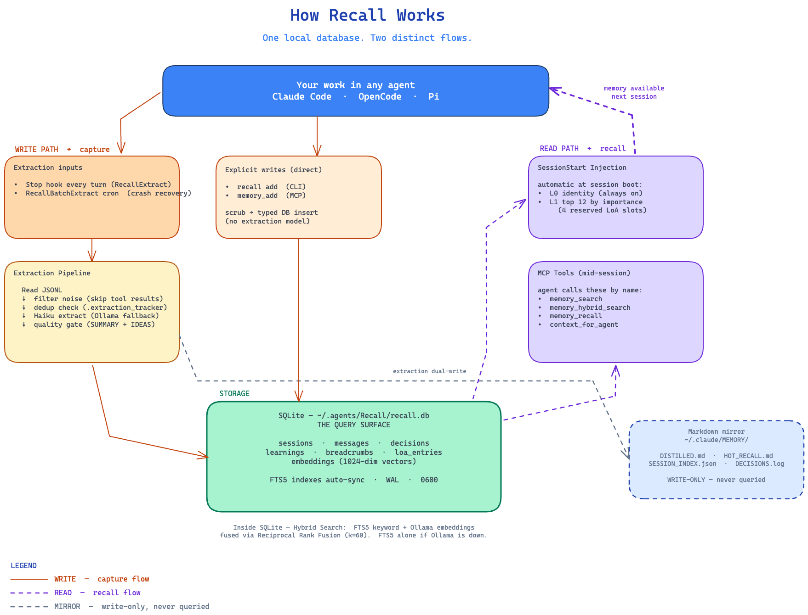

<p align="center">
  
</p>

## TL;DR

Recall is a retrieval-first memory layer: everything lands in one searchable database, the best of it is ranked and injected at session start, and decisions carry confidence, importance, and a lifecycle across any coding agent/harness.


> **A SQLite-backed persistent memory layer for coding agents.** Stop-hook extraction captures sessions as you work, MCP tools expose them mid-session, hybrid search (FTS5 + embeddings) retrieves them, and a tiered L0/L1 recall block injects identity + top-ranked records at every session start. Works across Claude Code, OpenCode, and Pi from one local database.

Got questions about the project? I'd suggest using [DeepWiki](https://deepwiki.com/edheltzel/Recall) from Devin/Cognition to ask questions about the project.


# Recall — Persistent Memory for Any Agent Harness

All coding agents forget when a session ends. Recall doesn't — it extracts, indexes, and recalls what matters across every session, across every agent you use.

Built on the [Model Context Protocol](https://modelcontextprotocol.io). One SQLite file. No phone-home. No vendor lock-in.

> Stable on [Claude Code](https://claude.com/claude-code). Beta on [Pi](https://pi.dev/) and Alpha for [OpenCode](https://opencode.ai/) (MCP works; lifecycle extensions are early). [Codex CLI](https://github.com/openai/codex) and [Gemini CLI](https://github.com/google-gemini/gemini-cli) on the roadmap. See [Roadmap](#roadmap).

---

[Jump to the Docs](#documentation)

## The Problem

AI agents have no memory between sessions. Context is lost. You repeat yourself. Decisions made last week are forgotten today. Every new session re-learns the basics.

## How Recall Fixes It

Install once, then forget about it. Recall runs silently in the background:

```
┌──────────┐    ┌────────────────┐    ┌──────────────┐    ┌───────────────┐    ┌──────────────┐
│ You Work │───▶│ Stop hook fires│───▶│ Auto-Extract │───▶│ SQLite + FTS5 │───▶│ Next Session │
└─────▲────┘    │ (end of turn)  │    └──────────────┘    └───────────────┘    └──────┬───────┘
      │         └────────────────┘                                                    │
      └───────────────────────────── Memory Available ───────────────────────────────┘
```

- **Auto-extraction** — sessions are parsed into structured summaries incrementally as you work (Stop hook fires at the end of every turn, not only when you exit)
- **Full-text + semantic search** — find anything from any past session
- **Tiered session-start context** — L0 identity (who you are) + L1 importance-ranked top records load automatically
- **Zero friction** — no workflow changes, no manual steps
- **MCP integration** — your agent searches memory automatically through standard MCP tools

## Why Recall

Four things that set Recall apart from cloud-hosted memory layers and from agent-specific scratch files:

- **Local-first, zero infrastructure.** One SQLite file at `~/.agents/Recall/recall.db` (override via `RECALL_DB_PATH`). WAL mode, `0600` perms. No vector database, no graph database, no agent server, no API keys for retrieval. Nothing leaves your machine — no telemetry, no phone-home. Optional Ollama for embeddings (also local).
- **Multi-agent native.** One memory layer across the agents you actually use. Stable on Claude Code today; Pi and OpenCode connect via MCP; Codex CLI and Gemini CLI on the way. Memories captured by one agent are searchable from any other agent on the same machine.
- **Structured taxonomy, not a flat blob.** Decisions (with supersede/revert lifecycle and confidence scoring), learnings, breadcrumbs, and curated **Library of Alexandria** entries — each has a purpose and a query path. Importance scoring (1–10) surfaces what matters first.
- **Hybrid search that works offline.** FTS5 keyword search ships with SQLite — no embedding infrastructure required to find anything. Optional Ollama embeddings layer on top for semantic queries. Both are merged via Reciprocal Rank Fusion. Lose Ollama, lose nothing — the keyword path keeps working.

## Quick Start

Recall requires [Bun](https://bun.sh) (it uses `bun:sqlite` and Bun-native hooks).

```bash
# Primary — install from npm with Bun, then configure
bun install -g recall-memory
recall install

# Secondary — one-shot via npx (Bun must be on PATH)
npx --package=recall-memory recall install
```

`recall install` runs the canonical setup (MCP server, hooks, slash commands, guides) for all detected agents. Prefer `bun install -g`: with `npm install -g`, the `#!/usr/bin/env bun` shebang depends on Bun being on PATH (nvm/fnm shells can hide it).

<details>
<summary>Install from source instead</summary>

```bash
git clone https://github.com/edheltzel/Recall.git
cd Recall
./install.sh
```

</details>

Verify it works:

```bash
recall stats        # Database overview
recall doctor       # Health check
```

Restart your agent (Claude Code, Pi, or OpenCode) to load the MCP server and hooks.

### First run: set your identity

Recall's tiered RecallStart injects a small identity file at the top
of every session (the L0 tier — your role, projects, tools, and working
preferences). Without it, L0 is empty and every new session has to
re-learn the basics.

```bash
recall onboard
```

A 7-question interview that writes `~/.claude/MEMORY/identity.md`. Run
it once. Re-run whenever your role, active projects, or working
preferences change. Use `|` (not `,`) to separate values so a phrase
like `no force-push, ever` survives as a single entry.

### Updating

From inside Claude Code, `/Recall:update` prints the current vs. latest
release and the exact command to run. From a shell:

```bash
./update.sh --check   # version check only
./update.sh           # full update: pull, build, migrate, re-register hooks
```

Installed from npm? Use `recall update` (same flags) — or `bun install -g recall-memory@latest && recall install` to bump the binary.

### Uninstalling

```bash
./uninstall.sh --dry-run   # preview, touch nothing
./uninstall.sh             # surgical remove; preserves ~/.agents/Recall/ (DB + backups)
./uninstall.sh --purge     # also destroy ~/.agents/Recall/ and any legacy DB (confirmed)
```

Installed from npm? Use `recall uninstall` (same flags, e.g. `--dry-run` / `--purge`).

> [Full installation guide](docs/installation.md) — prerequisites, platform support, session extraction setup, uninstalling

## How Recall Works

Recall sits between your agent and a single SQLite database. A **WRITE path** captures sessions as you work; a **READ path** injects memory back into every new session. The diagram below shows both flows side-by-side, with the line styles in the legend distinguishing capture (solid), recall (dashed purple), and the write-only markdown mirror (dashed gray).

<p align="center">
  
</p>

<details>
<summary>Text-only architecture diagram (for terminal viewers)</summary>

```
┌──────────────────────────────────────────────────────────────────────┐
│                        DATA ENTRY POINTS                             │
│                                                                      │
│  ┌────────────┐  ┌────────────┐  ┌──────────────┐  ┌────────────┐    │
│  │ CLI Direct │  │ MCP Server │  │  Stop Hook   │  │   Batch    │    │
│  │  recall add   │  │ (Claude    │  │ SessionExt-  │  │  Extract   │    │
│  │  recall dump  │  │  Code)     │  │  ract.ts     │  │  (cron)    │    │
│  └─────┬──────┘  └─────┬──────┘  └──────┬───────┘  └─────┬──────┘    │
└────────┼────────────────┼────────────────┼────────────────┼──────────┘
         │                │                │                │
         ▼                ▼                ▼                ▼
┌───────────────────────────────────────────────────────────────────────┐
│                      PROCESSING LAYER                                 │
│                                                                       │
│  Direct Inserts:              Session Extraction Pipeline:            │
│  recall add breadcrumb ──┐       Read JSONL                              │
│  recall add decision  ───┤         → Filter noise (tool results)         │
│  recall add learning  ───┤         → Dedup check (.extraction_tracker)   │
│  memory_add (MCP)  ───┤         → Acquire lock                        │
│                       │         → Claude Haiku extract                │
│                       │           (>120K? chunk → meta-extract)       │
│                       │           (fallback: Ollama)                  │
│                       │         → Quality gate                        │
│                       │           (requires SUMMARY + MAIN IDEAS)     │
│                       │              │                                │
└───────────────────────┼──────────────┼────────────────────────────────┘
                        │              │
                        ▼              ▼
┌──────────────────────────────────────────────────────────────────────┐
│                    STORAGE LAYER (Dual-Write)                        │
│                                                                      │
│  SQLite (~/.agents/Recall/recall.db)  Memory Files (~/.agents/Recall/MEMORY/) │
│  ┌────────────────────────────┐     ┌──────────────────────────────┐ │
│  │ sessions ←── messages      │     │ DISTILLED.md    (archive)    │ │
│  │ decisions    learnings     │     │ HOT_RECALL.md   (last 10)    │ │
│  │ breadcrumbs  loa_entries   │     │ SESSION_INDEX.json           │ │
│  │ embeddings (768-dim vecs)  │     │ DECISIONS.log                │ │
│  │                            │     │ REJECTIONS.log               │ │
│  │ FTS5 indexes (auto-sync)   │     │ ERROR_PATTERNS.json          │ │
│  │ WAL mode · 0600 perms      │     └──────────────────────────────┘ │
│  └────────────────────────────┘                                      │
└──────────────────────────────────────────────────────────────────────┘
                        │
                        ▼
┌──────────────────────────────────────────────────────────────────────┐
│                      RETRIEVAL LAYER                                 │
│                                                                      │
│  ┌───────────────┐  ┌────────────────┐  ┌─────────────────────────┐  │
│  │Keyword (FTS5) │  │Semantic (Embed)│  │  Hybrid (RRF Fusion)    │  │
│  │recall search     │  │recall semantic    │  │  recall hybrid (DEFAULT)   │  │
│  │memory_search  │  │embed → Ollama  │  │  FTS5 rank ─┐           │  │
│  │               │  │cosine sim      │  │  Embed rank ─┤→ merged  │  │
│  └───────────────┘  └────────────────┘  │  RRF(k=60) ◄┘           │  │
│                                         └─────────────────────────┘  │
│  Direct: recall recent · recall show · memory_recall · context_for_agent   │
└──────────────────────────────────────────────────────────────────────┘
                        │
                        ▼
┌──────────────────────────────────────────────────────────────────────┐
│  CONSUMERS:  Coding agents (MCP)  ·  CLI user (recall)  ·  Sub-agents   │
└──────────────────────────────────────────────────────────────────────┘
```

</details>

The source `.excalidraw` file lives at [`assets/how-recall-works.excalidraw`](assets/how-recall-works.excalidraw) — drop it onto [excalidraw.com](https://excalidraw.com) to edit.

### Session Lifecycle

1. **Session starts** — A `SessionStart` hook injects two tiers of context: **L0 identity** (your `~/.claude/MEMORY/identity.md`, always on) and **L1 top records** (top 12 by importance score, with 4 slots reserved for curated Library of Alexandria entries). L2/L3 stay on disk and are pulled on demand via MCP search.
2. **During the session** — your agent searches memory via MCP tools (`memory_search`, `memory_hybrid_search`, `memory_recall`, `context_for_agent`) before falling back to git history. Decisions, learnings, and breadcrumbs are recorded in real-time with `memory_add`.
3. **End of every turn** — A `Stop` hook fires `RecallExtract.ts`, which self-spawns a background process (non-blocking). It checks `.extraction_tracker.json` and only re-extracts if the conversation has grown meaningfully since last time — so capture is incremental, not just an "on exit" event.
4. **Extraction pipeline** — The conversation JSONL is filtered, deduplicated, and sent to the `claude` CLI running Haiku (with chunking for large sessions >120K chars). Optional Ollama fallback if the CLI fails. A quality gate rejects low-quality extractions before they're stored.
5. **PreCompact flush** — When Claude Code is about to compact its context, a `PreCompact` hook (`RecallPreCompact.ts`) flushes the in-flight messages first, so the squashed window is never lost.
6. **Dual-write storage** — Results are written to SQLite (the only query surface — every CLI/MCP read hits this) and to markdown artifacts (`DISTILLED.md`, `HOT_RECALL.md`, etc., write-only, human-readable).
7. **Batch catchup (optional)** — A cron job (`RecallBatchExtract.ts`) sweeps any sessions the Stop hook missed during crashes or interruptions, and ingests sessions dropped by the OpenCode plugin and Pi extension into `~/.claude/MEMORY/{opencode,pi}-sessions/`. `install.sh` prints the registration command at the end — opt in by running it once; nothing is auto-scheduled.
8. **TELOS auto-sync (PAI users)** — If you use [Personal AI Infrastructure (PAI)](https://github.com/danielmiessler/Personal_AI_Infrastructure), Recall ships a `RecallTelosSync.ts` SessionStart hook that watches `~/.claude/skills/PAI/USER/TELOS/` for changes and silently runs `recall telos import --update` when any file is newer than the last import. This is **automatic** — no action required once Recall is installed and PAI's TELOS directory exists. You can also import manually at any time with `recall telos import --yes`. If you don't use PAI, the hook checks for the directory, finds nothing, and exits in under 1ms.

### Search Strategies

| Strategy             | Command                      | How it works                                                                                                            |
| -------------------- | ---------------------------- | ----------------------------------------------------------------------------------------------------------------------- |
| **Keyword**          | `recall search "query"`         | FTS5 full-text search across all tables. Use `-t decisions` to hard-filter, or `--bias-type decisions` to prefer decisions while keeping other matches. |
| **Semantic**         | `recall embed semantic "query"` | Ollama embeddings → cosine similarity (requires Ollama)                                                                 |
| **Hybrid** (default) | `recall "query"`                | Both keyword + semantic, merged with Reciprocal Rank Fusion (k=60). Falls back to keyword-only if Ollama is unavailable |

**Narrowing by record type — `table` vs `bias_type`.** Both let you steer results toward decisions, learnings, breadcrumbs, LoA entries, or raw messages, but they differ in strength:

- **`-t` / `table`** is a **hard filter** — only the named record type comes back.
- **`--bias-type` / `bias_type`** is a **soft boost** — matching records of that type rank higher, but every other type can still appear when it's relevant.

**Where it's available:** `table` and `bias_type` act on FTS5 ranking, so they exist **only on the keyword path** — `recall search`, `recall "query" -k`, and the MCP `memory_search` tool. They are silently ignored elsewhere: plain `recall "query"` (default hybrid), `recall "query" -v` (semantic), and `memory_hybrid_search` rank by embedding distance and have no `bias_type`. Valid types: `messages`, `decisions`, `learnings`, `breadcrumbs`, `loa`.

> [Architecture deep-dive](docs/architecture.md) — database tables, FTS5 indexes, extraction pipeline details

## What You Get

- **Auto-captured session memory** — extracted incrementally (Stop hook on every turn) via Claude Haiku, with `RecallBatchExtract.ts` cron sweeper as a crash-recovery safety net
- **MCP server (`recall-mcp`)** — `memory_search`, `memory_hybrid_search`, `memory_recall`, `memory_add`, `memory_dump`, `context_for_agent` exposed to your agent mid-session. `memory_search` supports `table` hard filters and `bias_type` soft boosts.
- **Hybrid search** — FTS5 keyword search + optional Ollama embeddings, fused via Reciprocal Rank Fusion. Lose Ollama, lose nothing — keyword path keeps working. Type targeting (`table` / `bias_type`) is a keyword-path feature — see [Search Strategies](#search-strategies).
- **Tiered RecallStart (v0.7.0+)** — L0 identity (`~/.claude/MEMORY/identity.md`) + L1 top 12 records ranked by importance, with 4 reserved slots for curated Library of Alexandria entries. L2/L3 fetched on demand
- **Importance scoring (1–10)** — every record carries an importance score that drives what surfaces in L1. Manage with `recall pin` / `recall unpin` / `recall importance backfill`
- **PreCompact flush** — `RecallPreCompact.ts` writes in-flight messages to SQLite before Claude compacts its context window, so the squashed chunk is never lost
- **Decision lifecycle** — `recall decision supersede/revert` tracks when a decision was replaced or rolled back; confidence scoring (high/medium/low) on every decision and learning
- **Cross-host ingestion** — OpenCode plugin and Pi extension drop sessions into `~/.claude/MEMORY/{opencode,pi}-sessions/`; RecallBatchExtract pulls them into the same SQLite DB. One memory layer across agents
- **Library of Alexandria** — curated knowledge entries (session distillations, imported docs, telos goals, quotes) with Fabric `extract_wisdom` analysis. Default importance 8 — these get reserved L1 slots
- **TELOS integration ([PAI](https://github.com/danielmiessler/Personal_AI_Infrastructure) users)** — `RecallTelosSync.ts` auto-imports your TELOS framework files (goals, mission, projects, strategies) from PAI's `USER/TELOS/` directory on every session start. Changes are detected by mtime; unchanged files are skipped. Manual import: `recall telos import --yes`
- **Breadcrumbs, decisions, learnings** — three structured record types for non-session memory, addable from CLI (`recall add`), MCP (`memory_add`), or slash commands (`/Recall:add`)
- **Codebase scouting** — `/Recall:scout [focus]` produces a memory-first scout report (repo map, key paths, tests, risks, next steps) for orienting in an unfamiliar repo, with a strict no-secrets boundary and chat-only-by-default output
- **Benchmark harness** — `recall benchmark run B` measures wake-up context efficiency against locked baselines so regressions are visible
- **Onboarding** — `recall onboard` runs a 7-question interview that writes your L0 identity file

## Measured wake-up efficiency

Suite B measures the byte cost of session-start memory injection. Latest tracked run ([2026-04-18, scope `atlas-recall`](benchmarks/results/2026-04-18T20-13-59-suite-B.md)):

| Variant                                      |     Chars | Tokens (est, 4 ch/tok) |
| -------------------------------------------- | --------: | ---------------------: |
| **v2 tiered RecallStart** (L0 + L1 top 12) | **5,306** |             **~1,327** |
| v1 flat-blob RecallStart (simulated)       |     8,020 |                 ~2,005 |
| CLAUDE.md static baseline                    |     8,760 |                 ~2,190 |

v2 is **51% smaller than v1** on this corpus. CLAUDE.md is hand-written static context; Recall is auto-extracted dynamic memory — the two are complementary, not competitors. Numbers scale with your own DB and L0 identity; reproduce with `recall benchmark run B`. Methodology and caveats live in [`benchmarks/README.md`](benchmarks/README.md).

## CLI at a Glance

```bash
recall "kubernetes auth"          # Search your memory
recall onboard                    # Seed your L0 identity tier (one-time)
recall dump "Session Title"       # Save this session
recall add decision "Use X" ...   # Record a decision
recall decision list              # List decisions with status and confidence
recall pin decisions 42           # Pin a record to high importance
recall benchmark run B            # Measure wake-up context efficiency
recall prune                      # Preview stale records for removal
recall stats                      # See what's stored
recall doctor                     # Health check
```

<details>
<summary>See it in action</summary>

| Search                                | Stats                               |
| ------------------------------------- | ----------------------------------- |
|  |  |

| Health Check                          | Recent Memory                         |
| ------------------------------------- | ------------------------------------- |
|  |  |

</details>

> [Full CLI reference](docs/cli-reference.md)

## For AI Agents

If you're an AI agent reading this repository:

| What you need                                                  | Where to find it                     |
| -------------------------------------------------------------- | ------------------------------------ |
| **Using Recall from Claude Code** (MCP tools, CLI, core rules) | [`FOR_CLAUDE.md`](FOR_CLAUDE.md)     |
| **Using Recall from OpenCode**                                 | [`FOR_OPENCODE.md`](FOR_OPENCODE.md) |
| **Using Recall from Pi**                                       | [`FOR_PI.md`](FOR_PI.md)             |
| **Developing Recall** (build, test, conventions)               | [`CLAUDE.md`](CLAUDE.md)             |

## Roadmap

Recall is built around two integration surfaces: **MCP** (memory search and add, available from inside the agent) and **lifecycle hooks** (auto-extraction, session-start context injection, pre-compact flushes). Different agents support different surfaces — the table below tracks where each one stands.

| Agent                                                         | MCP |                      Lifecycle hooks                       | Status                                |
| ------------------------------------------------------------- | :-: | :--------------------------------------------------------: | ------------------------------------- |
| [**Claude Code**](https://claude.com/claude-code)             | ✅  |            ✅ Stop · SessionStart · PreCompact             | **Stable** — reference implementation |
| [**Pi**](https://pi.dev/)                                     | ✅  | ⚠ Beta — `recall-compaction` + `recall-extract` extensions | In progress                           |
| [**OpenCode**](https://opencode.ai/)                          | ✅  |             ⚠ Alpha — `recall-extract` plugin              | In progress                           |
| [**Codex CLI**](https://github.com/openai/codex)              |  —  |                             —                              | Coming soon                           |
| [**Gemini CLI**](https://github.com/google-gemini/gemini-cli) |  —  |                             —                              | Coming soon                           |

**Candidate** — [Cursor](https://cursor.com): both `.cursor/hooks.json` and MCP are first-class; the integration model maps cleanly onto Recall's existing hook architecture. Tracked but not started.

Have an agent you'd like to see supported? [Open an issue](https://github.com/edheltzel/Recall/issues) — Recall is designed to be agent-agnostic, and any host that speaks MCP is a candidate.

## Documentation

| Guide                                      | Description                                                               |
| ------------------------------------------ | ------------------------------------------------------------------------- |
| [Installation](docs/installation.md)       | Prerequisites, install, verify, session extraction                        |
| [CLI Reference](docs/cli-reference.md)     | All commands and options                                                  |
| [MCP Tools](docs/mcp-tools.md)             | Tools available to AI agents                                              |
| [Architecture](docs/architecture.md)       | Database, search, extraction pipeline                                     |
| Codebase Map (local)                       | Interactive visual map at `.agents/atlas/artifacts/2026-06-10-recall-codebase-map.html` — generated from the codegraph index, not committed (`.agents/` is gitignored) |
| [Slash Commands](docs/slash-commands.md)   | `/Recall:*` commands for Claude Code                                      |
| [Upgrading](docs/upgrading.md)             | Update, backup, migration system                                          |
| [Troubleshooting](docs/troubleshooting.md) | Common issues and fixes                                                   |
| [Changelog](CHANGELOG.md)                  | Release notes and breaking changes                                        |
## Acknowledgments

Graciously borrowing and features inspired by:

- [MemPalace](https://github.com/MemPalace/mempalace) — tiered session-start context, PreCompact hook, importance scoring
- [Personal AI Infrastructure (PAI)](https://github.com/danielmiessler/Personal_AI_Infrastructure) — TELOS framework integration

## License

MIT
