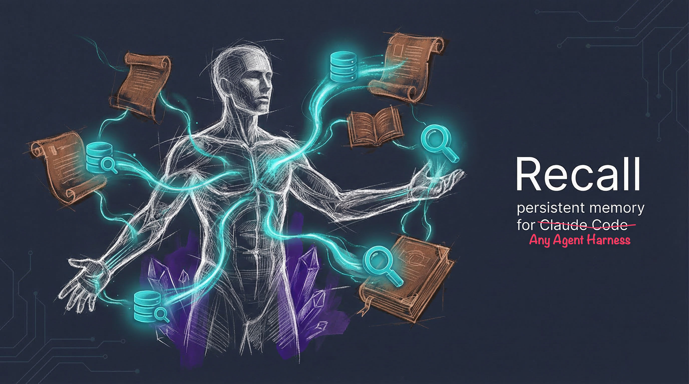

<p align="center">
  
</p>

# Recall — Persistent Memory for Claude Code

Recall gives Claude Code persistent memory across sessions. Conversations are automatically extracted, indexed, and searchable.

---

## For AI Agents

If you're an AI agent reading this repository, here's where to look:

| What you need | Where to find it |
|---------------|-----------------|
| **Using Recall** (MCP tools, CLI, core rules) | [`FOR_CLAUDE.md`](FOR_CLAUDE.md) — installed as `~/.claude/Recall_GUIDE.md` |
| **Developing Recall** (build, test, conventions, project structure) | [`CLAUDE.md`](CLAUDE.md) |
| **Architecture & usage details** | This file — sections below |

Start with `FOR_CLAUDE.md` if you need to **use** memory. Start with `CLAUDE.md` if you need to **modify** the codebase.

---

## What Recall Does

Without Recall, every Claude Code session starts from zero. With Recall:

- **Session Extraction** — When a session ends, the conversation is automatically extracted into structured summaries (ideas, decisions, errors fixed, insights)
- **Full-Text Search** — Search all past conversations via `mem search "kubernetes migration"` or the MCP `memory_search` tool
- **Hybrid Search** — Combines keyword (FTS5) and semantic (vector embeddings) search with Reciprocal Rank Fusion
- **Library of Alexandria (LoA)** — Curated knowledge entries with Fabric extract_wisdom analysis
- **Decision Tracking** — Record and search architectural decisions with reasoning
- **Learning Capture** — Record problems solved and patterns discovered
- **Breadcrumbs** — Drop contextual notes for future sessions
- **MCP Server** — Claude Code can search memory, add records, and prepare context for spawned agents — all via MCP tools
- **Batch Extraction** — Cron job catches any sessions that slipped through the cracks

## How It Works

After installation, Recall runs silently in the background:

1. **You work normally** with Claude Code on your projects
2. **Sessions auto-extract** — when you end a session, the `SessionExtract` hook parses the conversation via Claude Haiku and stores structured summaries in `~/.claude/MEMORY/`
3. **Database grows** — extracted sessions, decisions, learnings, and breadcrumbs accumulate in `~/.claude/memory.db` (SQLite with FTS5 indexes)
4. **Next session** — Claude Code has MCP tools (`memory_search`, `memory_recall`, `context_for_agent`) to find relevant past context automatically
5. **Over time** — your memory database grows, and Claude gets better at your specific projects and patterns

---

## Installation

### Prerequisites

Install these before running `install.sh`. Each is required unless marked optional.

**Supported platforms:** macOS (primary, tested on 13+ with Apple Silicon and Intel) and Linux (tested on Ubuntu 22.04+, Debian 12+).

#### 1. Bun (JavaScript runtime)

Recall uses Bun for TypeScript execution and `bun:sqlite` for the database.

```bash
# macOS (Homebrew)
brew install oven-sh/bun/bun

# Linux / macOS (curl)
curl -fsSL https://bun.sh/install | bash
source ~/.bashrc   # or: source ~/.zshrc on macOS
```

Minimum version: 1.0+ — [bun.sh](https://bun.sh)

#### 2. Node.js and npm

Required for global linking so `mem` and `mem-mcp` are on your PATH.

```bash
# macOS (Homebrew)
brew install node

# Linux (Ubuntu/Debian)
curl -fsSL https://deb.nodesource.com/setup_22.x | sudo -E bash -
sudo apt-get install -y nodejs

# Any platform (nvm)
curl -o- https://raw.githubusercontent.com/nvm-sh/nvm/v0.40.0/install.sh | bash
nvm install --lts
```

Minimum version: Node 18+ — [nodejs.org](https://nodejs.org)

#### 3. Claude Code (Anthropic CLI)

Recall is an extension for Claude Code. You need a working Claude Code installation.

```bash
npm install -g @anthropic-ai/claude-code
```

Requires an active Anthropic API subscription or Claude Pro/Max plan — [docs.anthropic.com](https://docs.anthropic.com/en/docs/claude-code)

#### 4. Fabric (Optional but Recommended)

Fabric provides the `extract_wisdom` pattern used for rich LoA (Library of Alexandria) entries. Recall falls back to an inline prompt if Fabric isn't available, but Fabric extractions are higher quality.

```bash
go install github.com/danielmiessler/fabric@latest
fabric --setup
```

Requires Go 1.22+ — [github.com/danielmiessler/fabric](https://github.com/danielmiessler/fabric)

#### 5. Ollama (Optional — for Semantic Search)

Vector embeddings enable semantic search (find related content even when keywords don't match). Without Ollama, Recall uses keyword search only, which works well for most queries.

```bash
# macOS
brew install ollama
ollama pull nomic-embed-text

# Linux
curl -fsSL https://ollama.ai/install.sh | sh
ollama pull nomic-embed-text
```

Model: `nomic-embed-text` (768-dimension embeddings, ~270MB). Set `OLLAMA_URL` if Ollama runs on a different host (default: `http://localhost:11434`) — [ollama.ai](https://ollama.ai)

### Install Recall

Clone the repository wherever you keep your projects, then run the installer:

```bash
git clone https://github.com/edheltzel/Recall.git
cd Recall
./install.sh
```

The installer auto-detects your OS (macOS or Linux) and will:
1. Back up any existing Claude Code config files (`.mcp.json`, `.claude.json`, `CLAUDE.md`, `settings.json`, `memory.db`)
2. Install dependencies via `bun install`
3. Build TypeScript source via `tsup`
4. Link `mem` and `mem-mcp` globally via `bun link`
5. Initialize the SQLite database at `~/.claude/memory.db`
6. Register the MCP server in `~/.claude/settings.json` under `mcpServers` (user scope — available in all projects)
7. Set up session extraction hooks in `~/.claude/hooks/` and register in `~/.claude/settings.json`
8. Copy the Claude guide to `~/.claude/Recall_GUIDE.md`
9. Add a MEMORY section to `~/.claude/CLAUDE.md`

**After install:** Restart Claude Code to load the MCP server and hooks.

### Verify Installation

```bash
which mem mem-mcp          # CLI linked
ls -la ~/.claude/memory.db # Database exists
mem stats                  # Should return counts
```

### Session Extraction (Automatic)

The installer sets up session extraction automatically. Every session end triggers the hook, which:
1. Reads the session's JSONL conversation file
2. Sends it to Claude Haiku for structured extraction
3. Appends results to 6 memory files in `~/.claude/MEMORY/`
4. Tracks extraction state to prevent duplicates

If Haiku is unavailable, it falls back to a local Ollama model (configurable via `Recall_OLLAMA_MODEL`).

**(Optional)** Set up cron for batch extraction of missed sessions:
```bash
crontab -e
# Add this line (runs every 30 minutes):
*/30 * * * * ~/.bun/bin/bun run ~/.claude/hooks/BatchExtract.ts --limit 20 >> /tmp/recall-batch.log 2>&1
```

---

## Usage

### Daily Workflow

1. **Session start** — Memory is automatically available via MCP. Claude Code can call `memory_recall` or `memory_search` to load context from past sessions.
2. **During a session** — Claude uses `memory_search` before asking you to repeat information, records decisions with `memory_add`, and calls `context_for_agent` before spawning agents.
3. **End of session** — Tell Claude to run `mem dump "Descriptive Session Title"` to import the session and create a curated LoA entry.

### Session Import

Import existing Claude Code conversations into the database:

```bash
mem import --dry-run       # Preview what will be imported
mem import --yes -v        # Import all sessions from ~/.claude/projects/
```

Run this after installing Recall to backfill your history.

### Library of Alexandria (LoA)

LoA is the core knowledge capture mechanism. Raw transcripts are noise — LoA entries contain Fabric-extracted insights, message lineage, continuation chains, and project context.

```bash
mem loa write "Session Title"          # Capture messages since last LoA
mem loa write "VPN Config" -p infra    # Tag with project
mem loa write "VPN Part 2" -c 1        # Continue from previous entry (creates a chain)
mem loa write "Auth System" -t "auth"  # Add tags
mem loa list                           # List recent entries
mem loa show 1                         # View full Fabric extract
mem loa quote 1                        # View raw source messages
```

The `mem dump` command combines session import + LoA capture in one step — use it at the end of every session.

### Structured Records

#### Decisions

Record architectural and process decisions with reasoning:

```bash
mem add decision "Use TypeScript over Python" --why "Type safety, team preference" -p myproject
```

Decisions have statuses: `active`, `superseded`, `reverted`.

#### Learnings

Record problems solved and patterns discovered:

```bash
mem add learning "Port conflict on 4000" "Kill process or change port" --prevention "Use dynamic port allocation"
```

#### Breadcrumbs

Quick context notes, references, TODOs:

```bash
mem add breadcrumb "User prefers dark mode in all UIs" -p myproject -i 8   # importance 1-10
```

### Search

```bash
mem "query"                    # Hybrid search (keyword + semantic, default)
mem "query" -k                 # Keyword only (FTS5)
mem "query" -v                 # Semantic only (requires Ollama)
mem search "query" -t decisions  # Search specific table
mem search "query" -p myproject  # Filter by project
```

FTS5 supports `AND`, `OR`, `NOT` operators, prefix matching (`auth*`), and exact phrases (`"vpn config"`).

#### Backfilling Embeddings

```bash
mem embed stats                # Check embedding service
mem embed backfill -t loa      # Generate embeddings for LoA entries
mem embed backfill -t decisions  # Generate embeddings for decisions
```

### TELOS Framework (Optional)

TELOS structures your AI's purpose and goals. If you have a structured purpose document:

```bash
mem telos import --dry-run     # Preview
mem telos import --yes -u      # Import (update existing)
mem telos list -t goal         # Goals only
mem telos show G7              # Specific entry
```

### Document Import (Optional)

Import standalone markdown files as searchable documents:

```bash
mem docs import --dry-run      # Preview
mem docs import --yes          # Import
mem docs search "architecture" # Search
```

---

## MCP Tools

When Claude Code connects to the Recall MCP server, these tools become available:

### memory_search

FTS5 keyword search across all memory tables. **Use before asking the user to repeat anything.**
```
memory_search({ query: "kubernetes auth", project: "my-app", table: "decisions", limit: 10 })
```

### memory_hybrid_search

Combined keyword + semantic search with Reciprocal Rank Fusion. Best for natural language queries. Falls back to keyword-only if embeddings unavailable.
```
memory_hybrid_search({ query: "how did we handle rate limiting", project: "my-app" })
```

### memory_recall

Get recent context — LoA entries, decisions, and breadcrumbs. Good for session start.
```
memory_recall({ limit: 5, project: "my-app" })
```

### context_for_agent

**Call this before spawning any agent via the Task tool.** Uses hybrid search to find relevant memory context. Also recommends whether to call Brave web search based on task indicators.
```
context_for_agent({ agent_task: "Refactor the auth middleware", project: "my-app" })
```

### memory_add

Add structured records during sessions.
```
memory_add({ type: "decision", content: "Use PostgreSQL over MySQL", detail: "Better JSON support" })
memory_add({ type: "learning", content: "bun:sqlite uses $param syntax", detail: "Not :param like better-sqlite3" })
memory_add({ type: "breadcrumb", content: "Auth refactor in progress, don't touch middleware" })
```

### memory_stats

Get database statistics (record counts, database size).

### loa_show

Show a full Library of Alexandria entry with its Fabric extract_wisdom content.
```
loa_show({ id: 1 })
```

---

## Architecture

### File Layout

```
~/.claude/
├── memory.db                          # SQLite database (FTS5 + WAL mode)
├── Recall_GUIDE.md                    # Guide for the Claude Code instance
├── MEMORY/
│   ├── DISTILLED.md                   # All extracted session summaries (full archive)
│   ├── HOT_RECALL.md                  # Last 10 sessions (fast context loading)
│   ├── SESSION_INDEX.json             # Searchable session metadata lookup
│   ├── DECISIONS.log                  # Architectural decisions (deduplicated)
│   ├── REJECTIONS.log                 # Things to avoid
│   ├── ERROR_PATTERNS.json            # Known error/fix pairs
│   ├── extract_prompt.md              # Extraction prompt template (used by hooks)
│   ├── EXTRACT_LOG.txt                # Extraction run log (checked by mem doctor)
│   └── .extraction_tracker.json       # Per-file extraction state (dedup + retry)
├── hooks/
│   ├── SessionExtract.ts              # Stop hook — extracts sessions on exit
│   └── BatchExtract.ts                # Cron batch extractor for missed sessions
└── settings.json                      # Hook registration + MCP server (recall-memory)
```

### Database Tables

| Table | Purpose | FTS5 Indexed |
|-------|---------|:---:|
| `sessions` | Claude Code session metadata (ID, timestamps, project, branch) | No |
| `messages` | Conversation turns (user + assistant content) | Yes |
| `loa_entries` | Library of Alexandria curated knowledge with Fabric extraction | Yes |
| `decisions` | Architectural decisions with reasoning and status | Yes |
| `learnings` | Problems solved and patterns discovered | Yes |
| `breadcrumbs` | Contextual notes, references, and TODOs (with importance 1-10) | Yes |
| `telos` | Purpose framework entries — Problems, Missions, Goals, Strategies (optional) | Yes |
| `documents` | Imported standalone markdown documents (optional) | Yes |
| `embeddings` | Vector embeddings for semantic search (768-dim, nomic-embed-text) | N/A |

All FTS5-indexed tables have automatic sync triggers (INSERT/UPDATE/DELETE keeps the FTS5 index consistent).

### Search Architecture

| Mode | Command | MCP Tool | How It Works |
|------|---------|----------|-------------|
| **Keyword** | `mem search "query"` | `memory_search` | SQLite FTS5 full-text search. Supports AND, OR, NOT, prefix*, "exact phrases" |
| **Semantic** | `mem semantic "query"` | — | Ollama embedding → cosine similarity against stored vectors |
| **Hybrid** | `mem "query"` | `memory_hybrid_search` | Both keyword + semantic combined via Reciprocal Rank Fusion (k=60). Falls back to keyword-only if Ollama unavailable |

### Extraction Pipeline

When a session ends:

```
Session End → Stop Hook → SessionExtract.ts
                              │
                              ├── Read JSONL conversation file
                              ├── Extract text (skip tool results, thinking blocks)
                              ├── If >120K chars: chunk and meta-extract
                              ├── Send to Claude Haiku API (or Ollama fallback)
                              ├── Quality gate: reject if missing "ONE SENTENCE SUMMARY"
                              ├── Append to DISTILLED.md (full archive)
                              ├── Update HOT_RECALL.md (last 10 sessions)
                              ├── Update SESSION_INDEX.json (searchable metadata)
                              ├── Append to DECISIONS.log (deduplicated)
                              ├── Append to REJECTIONS.log
                              └── Update ERROR_PATTERNS.json
```

The hook self-spawns in background so the session exits immediately (non-blocking).

### Technical Details

- **WAL mode** for concurrent reads (no locking during MCP queries)
- **FTS5** full-text search with automatic sync triggers
- **Foreign key constraints** enforced
- **File permissions** set to 0600 (owner read/write only)
- **Chunked extraction** for sessions >120K characters with meta-extraction merging
- **Quality gate** rejects extractions missing required sections
- **Retry window** of 24 hours for failed extractions
- **Parameterized queries** — no SQL injection vectors

---

## CLI Quick Reference

```bash
# SEARCH
mem "query"                    # Hybrid search (keyword + semantic, default)
mem "query" -k                 # Keyword only (FTS5)
mem "query" -v                 # Vector only (semantic, requires Ollama)
mem search "query"             # FTS5 search with options
mem search "query" -t decisions  # Search specific table
mem search "query" -p myproject  # Filter by project
mem semantic "query"           # Semantic search (explicit)
mem hybrid "query"             # Hybrid search (explicit)

# CAPTURE
mem dump "title"               # Session → LoA (end of session)
mem loa write "title"          # Messages → LoA
mem add decision "X" --why "Y" # Structured decision
mem add learning "P" "S"       # Problem → Solution
mem add breadcrumb "note"      # Quick note

# VIEW
mem loa list                   # Recent LoA entries
mem loa show 1                 # Full Fabric extract
mem loa quote 1                # Raw source messages
mem recent                     # Recent records across all tables
mem recent decisions           # Recent decisions only
mem show decisions 5           # Show full decision #5
mem stats                      # Database stats
mem doctor                     # Health check all subsystems

# IMPORT
mem import --yes               # Import sessions from ~/.claude/projects/
mem import-legacy --yes        # Import DISTILLED.md extracts as LoA entries
mem docs import --yes          # Import standalone markdown documents
mem telos import --yes         # Import TELOS framework entries
mem embed backfill -t loa      # Generate embeddings for LoA entries
mem embed stats                # Check embedding service status
mem init                       # Initialize database (safe to re-run)
```

---

## Environment Variables

| Variable | Default | Purpose |
|----------|---------|---------|
| `MEM_DB_PATH` | `~/.claude/memory.db` | Database file location |
| `OLLAMA_URL` | `http://localhost:11434` | Ollama server URL for embeddings |
| `EMBEDDING_MODEL` | `nomic-embed-text` | Ollama model for vector embeddings (768-dim) |
| `Recall_OLLAMA_MODEL` | `qwen2.5:3b` | Ollama model for extraction fallback (when Anthropic API unavailable) |
| `RECALL_BASE_DIR` | `~/.claude` | Base directory for document imports |

---

## Updating

```bash
cd <your-recall-directory>
git pull
bun install
bun run build
bun link
```

Your database and memory files are preserved across updates. To also update the hooks:
```bash
cp hooks/SessionExtract.ts ~/.claude/hooks/
cp hooks/BatchExtract.ts ~/.claude/hooks/
```

---

## Backup & Restore

```bash
./install.sh list              # List available backups
./install.sh restore           # Restore most recent backup
./install.sh restore 20260219  # Restore specific backup
```

The installer automatically backs up existing files before any changes. Backups are stored at `~/.claude/backups/recall/`.

Manual backup:
```bash
cp ~/.claude/memory.db ~/.claude/memory.db.backup
```

---

## Troubleshooting

### First Step: Run Doctor

```bash
mem doctor
```

This checks all subsystems: database, MCP registration, hooks, extraction tracker, CLI paths, and Ollama. Start here before debugging individual issues.

### "Database not found"
```bash
mem init
```

### "Bun install fails — unzip required" (Linux only)
```bash
sudo apt-get install -y unzip
```

### "Fabric extraction failed"
Fabric is optional — only needed for `mem loa write` and `mem dump`. Core functionality (search, add, MCP tools) works without it.

```bash
echo "test" | fabric --pattern extract_wisdom
```

### "MCP server not connecting"
1. Run diagnostics: `mem doctor`
2. Check config: `grep recall-memory ~/.claude/settings.json`
3. Verify PATH: `which mem-mcp`
4. Test manually: `mem-mcp` (should hang waiting for stdin — Ctrl+C to exit)
5. Restart Claude Code

### "Session extraction not running"
1. Run diagnostics: `mem doctor`
2. Check hook registered: `grep SessionExtract ~/.claude/settings.json`
3. Check hook file exists: `ls ~/.claude/hooks/SessionExtract.ts`
4. Check bun accessible: `which bun` (hooks resolve bun dynamically — not hardcoded to `~/.bun/bin`)
5. Check claude CLI available: `which claude`

### "Embedding service unavailable"
Embeddings are optional. Hybrid search falls back to FTS5-only automatically.

To enable:
```bash
ollama pull nomic-embed-text
curl http://localhost:11434/api/tags   # Verify
```

---

## License

MIT
