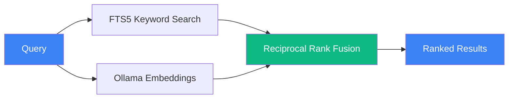
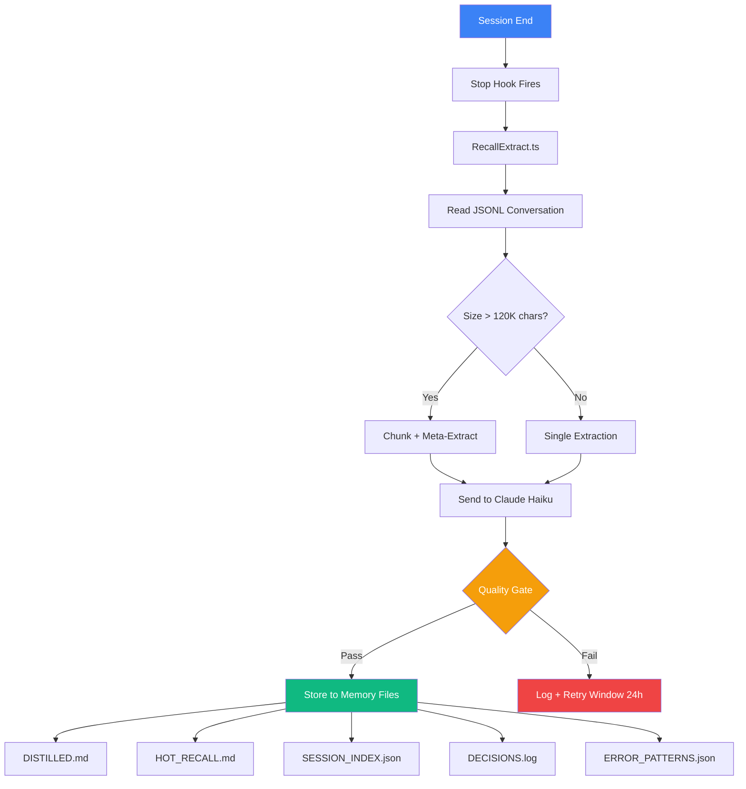

# Architecture

[← Back to README](../README.md)

## File Layout

Canonical Recall files live under `~/.agents/Recall/`. Platform homes
(`~/.claude/`, `~/.config/opencode/`, `~/.pi/agent/`) contain per-file
symlinks back to those canonicals.

```
~/.agents/Recall/                       # Recall install root (canonical files)
├── recall.db                           # SQLite database (FTS5 + WAL mode)
├── recall.db-wal
├── recall.db-shm
├── shared/
│   ├── hooks/                          # Canonical hook files (.ts)
│   │   └── lib/                        # Hook helpers (.ts)
│   └── extract_prompt.md               # Extraction prompt template
├── claude/
│   ├── commands/Recall/                # Slash-command files
│   └── Recall_GUIDE.md                 # Guide for Claude Code
├── opencode/
│   ├── plugins/                        # OpenCode plugin canonicals
│   └── Recall_GUIDE.md                 # Guide for OpenCode
├── pi/
│   ├── extensions/                     # Pi extension canonicals
│   └── Recall_GUIDE.md                 # Guide for Pi
├── MEMORY/                             # Migrated user-authored MEMORY files
│   ├── identity.md                     # L0 identity (user-authored via recall onboard)
│   └── DISTILLED.md                    # All extracted session summaries (full archive)
└── backups/                            # Pre-install + pre-update snapshots

~/.claude/                              # Claude Code home (mostly symlinks back)
├── Recall_GUIDE.md                     # → ~/.agents/Recall/claude/Recall_GUIDE.md
├── MEMORY/
│   ├── identity.md                     # → ~/.agents/Recall/MEMORY/identity.md
│   ├── DISTILLED.md                    # → ~/.agents/Recall/MEMORY/DISTILLED.md
│   ├── HOT_RECALL.md                  # Last 10 sessions (fast context loading)
│   ├── SESSION_INDEX.json             # Searchable session metadata lookup
│   ├── DECISIONS.log                  # Architectural decisions (deduplicated)
│   ├── REJECTIONS.log                 # Things to avoid
│   ├── ERROR_PATTERNS.json            # Known error/fix pairs
│   ├── extract_prompt.md              # Extraction prompt template (used by hooks)
│   ├── EXTRACT_LOG.txt                # Extraction run log (checked by recall doctor)
│   └── .extraction_tracker.json       # Per-file extraction state (dedup + retry)
├── hooks/                              # All entries below are symlinks
│   ├── RecallStart.ts                # → ~/.agents/Recall/shared/hooks/RecallStart.ts
│   ├── RecallPreCompact.ts            # → ~/.agents/Recall/shared/hooks/RecallPreCompact.ts
│   ├── RecallExtract.ts               # → ~/.agents/Recall/shared/hooks/RecallExtract.ts
│   ├── RecallBatchExtract.ts                 # → ~/.agents/Recall/shared/hooks/RecallBatchExtract.ts
│   └── lib/                            # → ~/.agents/Recall/shared/hooks/lib/
└── settings.json                       # Hook registration + MCP server (recall-memory)
```

Project-local L0 override: `./.atlas-recall/identity.md` takes precedence over
the global `~/.claude/MEMORY/identity.md`. `RECALL_IDENTITY_PATH` overrides
both.

## Database Tables

| Table | Purpose | FTS5 Indexed |
|-------|---------|:---:|
| sessions | Claude Code session metadata (ID, timestamps, project, branch) | No |
| messages | Conversation turns (user + assistant content); includes `importance` (1-10) column | Yes |
| loa_entries | Library of Alexandria curated knowledge with Fabric extraction; includes `importance` (1-10, floor 5) column | Yes |
| decisions | Architectural decisions with reasoning; includes `status` (active/superseded/reverted), `confidence` (high/medium/low), and `importance` (1-10) columns | Yes |
| learnings | Problems solved and patterns discovered; includes `confidence` (high/medium/low) and `importance` (1-10) columns | Yes |
| breadcrumbs | Contextual notes, references, and TODOs (with importance 1-10) | Yes |
| telos | Purpose framework entries (optional) | Yes |
| documents | Imported standalone markdown documents (optional) | Yes |
| embeddings | Vector embeddings for semantic search (1024-dim, qwen3-embedding:0.6b) | N/A |
| dedup_lineage | Duplicate lineage audit trail from `recall dedup` (survivor, duplicate, reason, similarity, status) | No |

All FTS5-indexed tables have automatic sync triggers.

The `importance` column was added in schema migration 7→8 (v0.7.0) on four
tables (`messages`, `decisions`, `learnings`, `loa_entries`). It controls L1
tier ranking at session start. Manage manually with `recall pin` / `recall unpin`
or backfill from confidence signals with `recall importance backfill`.

The `provenance` column was added in schema migration 8→9 on all five memory
tables (`messages`, `decisions`, `learnings`, `breadcrumbs`, `loa_entries`).
It declares how each record was created — `verbatim`, `user_authored`,
`extracted`, or `derived` — and is stamped automatically by every write path,
never accepted from callers (see
`docs/adr/0001-record-provenance-automatic-write-path-metadata.md`). Legacy
rows stay `NULL` (unknown) until classified with
`recall provenance backfill`, which only acts on deterministic write-path
evidence and never guesses.

The `dedup_lineage` table was added in schema migration 9→10. `recall dedup`
marks duplicate records non-destructively by writing lineage rows here
(survivor table/id, duplicate table/id, reason, similarity, status); marked
duplicates stay in their source tables but are hidden from search unless
`--include-duplicates` is passed. Survivor selection follows provenance order
(`user_authored > verbatim > extracted > derived > unknown`), then richness,
importance, and recency. Dedup acts within a table only; cross-table
candidates are report-only.

## Tiered RecallStart (v0.7.0+)

The `RecallStart` hook injects two tiers at the top of every session:

| Tier | Source | Cap | Purpose |
|------|--------|-----|---------|
| **L0 — Identity** | `identity.md` (user-authored) | 1200 chars | Who the user is, what projects they work on, working preferences. Always on, always first. Truncated silently beyond the cap. |
| **L1 — Importance-ranked** | Top 12 records across messages, decisions, learnings, LoA, ranked by `importance` DESC | 12 records | Load-bearing recent context. 4 of the 12 slots are reserved for LoA entries — LoA is often richer than any single decision. |

L2 (full search results) and L3 (raw message history) are documented in the
hook preamble but **not injected** — agents fetch them on demand via MCP
tools (`memory_hybrid_search`, `memory_recall`).

Path resolution for `identity.md`:
1. `RECALL_IDENTITY_PATH` env var (if set)
2. `./.atlas-recall/identity.md` (project-local, if exists)
3. `~/.claude/MEMORY/identity.md` (global default)

## PreCompact hook (v0.7.0+)

`hooks/RecallPreCompact.ts` fires before Claude Code compacts its own
context. It flushes any in-flight messages to SQLite so nothing is lost
during compaction. A byte-offset watermark prevents re-reading and it
cooperates with the Stop hook's extraction lock to avoid races.

## Search Architecture



| Mode | Command | MCP Tool | How It Works |
|------|---------|----------|-------------|
| Keyword | `recall search "query"` | memory_search | SQLite FTS5. Supports AND, OR, NOT, prefix*, "exact phrases", hard table filters (`-t` / `table`), and soft type boosts (`--bias-type` / `bias_type`) |
| Semantic | `recall semantic "query"` | — | Ollama embedding → cosine similarity against stored vectors |
| Hybrid | `recall "query"` | memory_hybrid_search | Both combined via Reciprocal Rank Fusion (k=60). Falls back to keyword-only if Ollama unavailable |

## Extraction Pipeline



The hook self-spawns in background so the session exits immediately (non-blocking).

If Haiku is unavailable, falls back to a local Ollama model (configurable via `RECALL_OLLAMA_MODEL`).

## Technical Details

### Lifecycle Management

- **Decision status transitions** — decisions move from `active` → `superseded` (replaced by a newer decision) or `active` → `reverted` (rolled back). The `decision_update` MCP tool and `recall decision` CLI command handle these transitions. Superseded decisions are retained for historical context.
- **Breadcrumb sweep** — at session start, the `RecallStart` hook ages out low-importance breadcrumbs (importance < 4) that are older than a configurable threshold. High-importance breadcrumbs persist until explicitly removed.
- **Prune strategy** — `recall prune` removes stale records: superseded/reverted decisions older than a retention window, breadcrumbs below an importance threshold, and orphaned embeddings with no parent row. Prune is always dry-run by default; pass `--execute` to commit changes.

- **WAL mode** for concurrent reads (no locking during MCP queries)
- **FTS5** full-text search with automatic sync triggers
- **Foreign key constraints** enforced
- **File permissions** set to 0600 (owner read/write only)
- **Chunked extraction** for sessions >120K characters with meta-extraction merging
- **Quality gate** rejects extractions missing required sections
- **Retry window** of 24 hours for failed extractions
- **Parameterized queries** — no SQL injection vectors
- **PRAGMA user_version** migration system for schema upgrades

## Benchmark harness (v0.7.0+)

`benchmarks/runner.ts` runs measurement suites and writes results to
`benchmarks/results/` as JSONL plus a human-readable `.md`. Suite B (token
efficiency) compares v2 wake-up context against v1 and the CLAUDE.md
baseline. Methodology is locked in via 5 rules documented in
`benchmarks/README.md`. Run suites via `recall benchmark run [suite]`.

## Lifecycle scripts (v0.7.2+)

Three shell scripts at the repo root manage the full install lifecycle.
They share behavior via `lib/install-lib.sh` so every path (fresh
install, update, uninstall) handles settings.json, hooks, MCP
registration, and global-link state identically.

| Script | Purpose | Key characteristics |
|---|---|---|
| `install.sh` | Fresh install or repair | Idempotent, creates a timestamped backup first, per-hook registration (not blanket), supports `restore` and `list` subcommands |
| `update.sh` | Pull + build + migrate + relink | Version check against GitHub Releases API; aborts cleanly if already current unless `--force`. Writes a `ROLLBACK.txt` recipe to the backup dir on any failure |
| `uninstall.sh` | Surgical removal | Preserve-default (keeps `recall.db`, backups, `MEMORY/`). `--purge` destroys DB + backups after double-confirmation. AST-aware CLAUDE.md `## MEMORY` section removal; diff-checked removal of user-edited `extract_prompt.md` |

All three accept `--dry-run` to narrate changes without touching anything.

### Shared library: `lib/install-lib.sh`

Sourced by all three scripts. Key functions:

| Function | Purpose |
|---|---|
| `recall_create_backup` | Snapshot of `settings.json`, `CLAUDE.md`, `recall.db`, OpenCode/Pi configs into `~/.claude/backups/recall/<TIMESTAMP>/` with a manifest including the git `PRE_SHA` for rollback |
| `recall_register_hook <event> <name> <command> [timeout]` | Idempotent single-hook writer for `settings.json`. Every hook is registered independently — no blanket early-return (fixes the pre-0.7.1 bug class structurally) |
| `recall_register_all_hooks` | Calls `recall_register_hook` for the four hooks Recall ships (`RecallExtract`, `RecallTelosSync`, `RecallStart`, `RecallPreCompact`). Safe to re-run — missing hooks are added, present hooks are skipped |
| `recall_link_global` | Hardened `bun link` flow: bun link → verify bin symlinks → `npm link` fallback → verify → exit 1 with recovery recipe. Catches the silent-no-op case where `bun link` exits 0 but doesn't refresh `~/.bun/bin/recall` / `recall-mcp` (added in 0.7.22) |
| `recall_verify_global_link` | Invariant checker: confirms `~/.bun/bin/recall` and `recall-mcp` exist, are symlinks, and resolve to readable targets. Emits an `ls -la` diagnostic block on failure |
| `recall_copy_runtime_files` | Copies `hooks/*.ts`, `hooks/lib/*.ts`, `commands/Recall/*.md`, `FOR_CLAUDE.md` → `Recall_GUIDE.md`, and `extract_prompt.md` (diff-check: writes `.new` on drift rather than overwriting user edits) |
| `recall_configure_claude_md` | Appends a `## MEMORY` section to `~/.claude/CLAUDE.md` only if absent; uninstall's counterpart removes it via an AST-aware node script that preserves everything before and after the section |

### Globals (overridable via env)

Callers can override these before sourcing `lib/install-lib.sh`:

```bash
CLAUDE_DIR="$HOME/.claude"
BACKUP_BASE="$CLAUDE_DIR/backups/recall"
TIMESTAMP="$(date +%Y%m%d_%H%M%S)"
BACKUP_DIR="$BACKUP_BASE/$TIMESTAMP"
OPENCODE_CONFIG_DIR="${XDG_CONFIG_HOME:-$HOME/.config}/opencode"
PI_CONFIG_DIR="$HOME/.pi/agent"
```

All use `: "${VAR:=default}"` so an override set *before* `source`
sticks. The test harness uses this to drive the lib against a tmpdir
`CLAUDE_DIR` without touching the real home.

### Slash command: `/Recall:update`

Check-only. Reads the current version, polls GitHub Releases, and
prints the exact `cd <path> && ./update.sh` recipe. **Never runs
`update.sh` inline** — the `recall` binary lives in the same `bun link`
process tree as the running Claude Code session, and rebuilding
mid-session can corrupt in-flight hook invocations. The safe
sequence is: exit Claude Code → `./update.sh` → restart.
