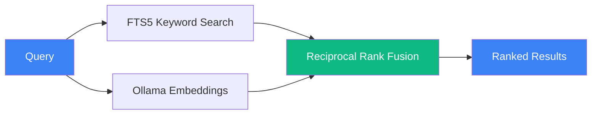

# Architecture

[← Back to README](../README.md)

## File Layout

```
~/.claude/
├── memory.db                          # SQLite database (FTS5 + WAL mode)
├── Recall_GUIDE.md                    # Guide for the Claude Code instance
├── MEMORY/
│   ├── identity.md                    # L0 identity (user-authored via mem onboard)
│   ├── DISTILLED.md                   # All extracted session summaries (full archive)
│   ├── HOT_RECALL.md                  # Last 10 sessions (fast context loading)
│   ├── SESSION_INDEX.json             # Searchable session metadata lookup
│   ├── DECISIONS.log                  # Architectural decisions (deduplicated)
│   ├── REJECTIONS.log                 # Things to avoid
│   ├── ERROR_PATTERNS.json            # Known error/fix pairs
│   ├── extract_prompt.md              # Extraction prompt template (used by hooks)
│   ├── EXTRACT_LOG.txt                # Extraction run log (checked by mem doctor)
│   └── .extraction_tracker.json       # Per-file extraction state (dedup + retry)
├── hooks/
│   ├── SessionRecall.ts               # SessionStart hook — injects L0 + L1 tiers
│   ├── SessionPreCompact.ts           # PreCompact hook — flushes in-flight messages
│   ├── SessionExtract.ts              # Stop hook — extracts sessions on exit
│   ├── BatchExtract.ts                # Cron batch extractor for missed sessions
│   └── lib/                           # Shared hook libraries (imported by hook scripts)
└── settings.json                      # Hook registration + MCP server (recall-memory)
```

Project-local L0 override: `./.atlas-recall/identity.md` takes precedence over
the global `~/.claude/MEMORY/identity.md`. `RECALL_IDENTITY_PATH` overrides
both.

## Database Tables

| Table | Purpose | FTS5 Indexed |
|-------|---------|:---:|
| sessions | Claude Code session metadata (ID, timestamps, project, branch) | No |
| messages | Conversation turns (user + assistant content); includes `importance` (1-10) column | Yes |
| loa_entries | Library of Alexandria curated knowledge with Fabric extraction; includes `importance` (1-10, floor 5) column | Yes |
| decisions | Architectural decisions with reasoning; includes `status` (active/superseded/reverted), `confidence` (high/medium/low), and `importance` (1-10) columns | Yes |
| learnings | Problems solved and patterns discovered; includes `confidence` (high/medium/low) and `importance` (1-10) columns | Yes |
| breadcrumbs | Contextual notes, references, and TODOs (with importance 1-10) | Yes |
| telos | Purpose framework entries (optional) | Yes |
| documents | Imported standalone markdown documents (optional) | Yes |
| embeddings | Vector embeddings for semantic search (768-dim, nomic-embed-text) | N/A |

All FTS5-indexed tables have automatic sync triggers.

The `importance` column was added in schema migration 7→8 (v0.7.0) on four
tables (`messages`, `decisions`, `learnings`, `loa_entries`). It controls L1
tier ranking at session start. Manage manually with `mem pin` / `mem unpin`
or backfill from confidence signals with `mem importance backfill`.

## Tiered SessionRecall (v0.7.0+)

The `SessionRecall` hook injects two tiers at the top of every session:

| Tier | Source | Cap | Purpose |
|------|--------|-----|---------|
| **L0 — Identity** | `identity.md` (user-authored) | 1200 chars | Who the user is, what projects they work on, working preferences. Always on, always first. Truncated silently beyond the cap. |
| **L1 — Importance-ranked** | Top 12 records across messages, decisions, learnings, LoA, ranked by `importance` DESC | 12 records | Load-bearing recent context. 4 of the 12 slots are reserved for LoA entries — LoA is often richer than any single decision. |

L2 (full search results) and L3 (raw message history) are documented in the
hook preamble but **not injected** — agents fetch them on demand via MCP
tools (`memory_hybrid_search`, `memory_recall`).

Path resolution for `identity.md`:
1. `RECALL_IDENTITY_PATH` env var (if set)
2. `./.atlas-recall/identity.md` (project-local, if exists)
3. `~/.claude/MEMORY/identity.md` (global default)

## PreCompact hook (v0.7.0+)

`hooks/SessionPreCompact.ts` fires before Claude Code compacts its own
context. It flushes any in-flight messages to SQLite so nothing is lost
during compaction. A byte-offset watermark prevents re-reading and it
cooperates with the Stop hook's extraction lock to avoid races.

## Search Architecture



| Mode | Command | MCP Tool | How It Works |
|------|---------|----------|-------------|
| Keyword | `mem search "query"` | memory_search | SQLite FTS5. Supports AND, OR, NOT, prefix*, "exact phrases" |
| Semantic | `mem semantic "query"` | — | Ollama embedding → cosine similarity against stored vectors |
| Hybrid | `mem "query"` | memory_hybrid_search | Both combined via Reciprocal Rank Fusion (k=60). Falls back to keyword-only if Ollama unavailable |

## Extraction Pipeline


The hook self-spawns in background so the session exits immediately (non-blocking).

If Haiku is unavailable, falls back to a local Ollama model (configurable via `RECALL_OLLAMA_MODEL`).

## Technical Details

### Lifecycle Management

- **Decision status transitions** — decisions move from `active` → `superseded` (replaced by a newer decision) or `active` → `reverted` (rolled back). The `decision_update` MCP tool and `mem decision` CLI command handle these transitions. Superseded decisions are retained for historical context.
- **Breadcrumb sweep** — at session start, the `SessionRecall` hook ages out low-importance breadcrumbs (importance < 4) that are older than a configurable threshold. High-importance breadcrumbs persist until explicitly removed.
- **Prune strategy** — `mem prune` removes stale records: superseded/reverted decisions older than a retention window, breadcrumbs below an importance threshold, and orphaned embeddings with no parent row. Prune is always dry-run by default; pass `--execute` to commit changes.

- **WAL mode** for concurrent reads (no locking during MCP queries)
- **FTS5** full-text search with automatic sync triggers
- **Foreign key constraints** enforced
- **File permissions** set to 0600 (owner read/write only)
- **Chunked extraction** for sessions >120K characters with meta-extraction merging
- **Quality gate** rejects extractions missing required sections
- **Retry window** of 24 hours for failed extractions
- **Parameterized queries** — no SQL injection vectors
- **PRAGMA user_version** migration system for schema upgrades

## Benchmark harness (v0.7.0+)

`benchmarks/runner.ts` runs measurement suites and writes results to
`benchmarks/results/` as JSONL plus a human-readable `.md`. Suite B (token
efficiency) compares v2 wake-up context against v1 and the CLAUDE.md
baseline. Methodology is locked in via 5 rules documented in
`benchmarks/README.md`. Run suites via `mem benchmark run [suite]`.
