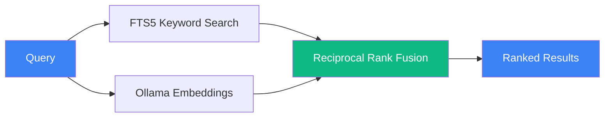

# Architecture

[← Back to README](../README.md)

## File Layout

```
~/.claude/
├── memory.db                          # SQLite database (FTS5 + WAL mode)
├── Recall_GUIDE.md                    # Guide for the Claude Code instance
├── MEMORY/
│   ├── DISTILLED.md                   # All extracted session summaries (full archive)
│   ├── HOT_RECALL.md                  # Last 10 sessions (fast context loading)
│   ├── SESSION_INDEX.json             # Searchable session metadata lookup
│   ├── DECISIONS.log                  # Architectural decisions (deduplicated)
│   ├── REJECTIONS.log                 # Things to avoid
│   ├── ERROR_PATTERNS.json            # Known error/fix pairs
│   ├── extract_prompt.md              # Extraction prompt template (used by hooks)
│   ├── EXTRACT_LOG.txt                # Extraction run log (checked by mem doctor)
│   └── .extraction_tracker.json       # Per-file extraction state (dedup + retry)
├── hooks/
│   ├── SessionExtract.ts              # Stop hook — extracts sessions on exit
│   ├── BatchExtract.ts                # Cron batch extractor for missed sessions
│   └── lib/                           # Shared hook libraries (imported by hook scripts)
└── settings.json                      # Hook registration + MCP server (recall-memory)
```

## Database Tables

| Table | Purpose | FTS5 Indexed |
|-------|---------|:---:|
| sessions | Claude Code session metadata (ID, timestamps, project, branch) | No |
| messages | Conversation turns (user + assistant content) | Yes |
| loa_entries | Library of Alexandria curated knowledge with Fabric extraction | Yes |
| decisions | Architectural decisions with reasoning; includes `status` (active/superseded/reverted) and `confidence` (high/medium/low) columns | Yes |
| learnings | Problems solved and patterns discovered; includes `confidence` (high/medium/low) column | Yes |
| breadcrumbs | Contextual notes, references, and TODOs (with importance 1-10) | Yes |
| telos | Purpose framework entries (optional) | Yes |
| documents | Imported standalone markdown documents (optional) | Yes |
| embeddings | Vector embeddings for semantic search (768-dim, nomic-embed-text) | N/A |

All FTS5-indexed tables have automatic sync triggers.

## Search Architecture



| Mode | Command | MCP Tool | How It Works |
|------|---------|----------|-------------|
| Keyword | `mem search "query"` | memory_search | SQLite FTS5. Supports AND, OR, NOT, prefix*, "exact phrases" |
| Semantic | `mem semantic "query"` | — | Ollama embedding → cosine similarity against stored vectors |
| Hybrid | `mem "query"` | memory_hybrid_search | Both combined via Reciprocal Rank Fusion (k=60). Falls back to keyword-only if Ollama unavailable |

## Extraction Pipeline


The hook self-spawns in background so the session exits immediately (non-blocking).

If Haiku is unavailable, falls back to a local Ollama model (configurable via `RECALL_OLLAMA_MODEL`).

## Technical Details

### Lifecycle Management

- **Decision status transitions** — decisions move from `active` → `superseded` (replaced by a newer decision) or `active` → `reverted` (rolled back). The `decision_update` MCP tool and `mem decision` CLI command handle these transitions. Superseded decisions are retained for historical context.
- **Breadcrumb sweep** — at session start, the `SessionRecall` hook ages out low-importance breadcrumbs (importance < 4) that are older than a configurable threshold. High-importance breadcrumbs persist until explicitly removed.
- **Prune strategy** — `mem prune` removes stale records: superseded/reverted decisions older than a retention window, breadcrumbs below an importance threshold, and orphaned embeddings with no parent row. Prune is always dry-run by default; pass `--execute` to commit changes.

- **WAL mode** for concurrent reads (no locking during MCP queries)
- **FTS5** full-text search with automatic sync triggers
- **Foreign key constraints** enforced
- **File permissions** set to 0600 (owner read/write only)
- **Chunked extraction** for sessions >120K characters with meta-extraction merging
- **Quality gate** rejects extractions missing required sections
- **Retry window** of 24 hours for failed extractions
- **Parameterized queries** — no SQL injection vectors
- **PRAGMA user_version** migration system for schema upgrades
