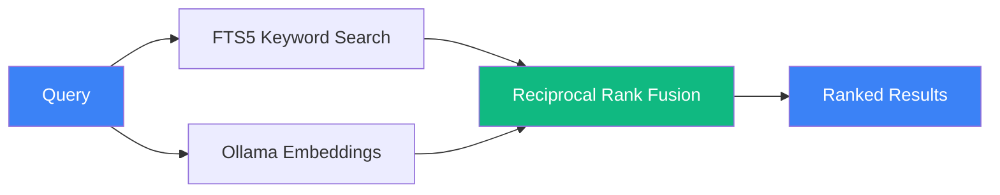
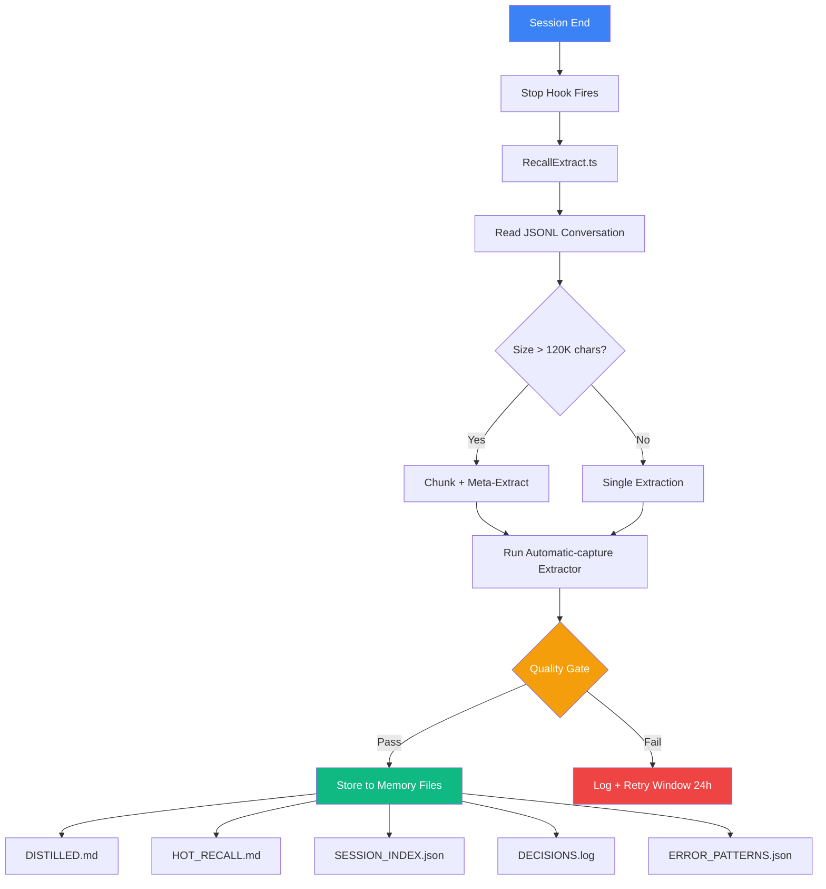

# Architecture

[← Back to README](../README.md)

## File Layout

Canonical Recall runtime files live under `~/.agents/Recall/`. Claude Code,
OpenCode, and Grok platform homes contain per-file symlinks back to those canonicals.
Pi instead records Recall's source as a native package and keeps its separately
installed MCP adapter/configuration under `~/.pi/agent/`.

```
~/.agents/Recall/                       # Recall install root (canonical files)
├── recall.db                           # SQLite database (FTS5 + WAL mode)
├── recall.db-wal
├── recall.db-shm
├── shared/
│   ├── hooks/                          # Canonical hook files (.ts)
│   │   └── lib/                        # Hook helpers (.ts)
│   ├── skills/                         # Agent Skill canonicals (do-recall-*)
│   └── extract_prompt.md               # Extraction prompt template
├── claude/
│   └── Recall_GUIDE.md                 # Guide for Claude Code
├── opencode/
│   ├── plugins/                        # OpenCode plugin canonicals
│   │   └── lib/                        # Plugin helpers (.ts)
│   └── Recall_GUIDE.md                 # Guide for OpenCode
├── pi/
│   └── Recall_GUIDE.md                 # Canonical guide linked into Pi home
├── grok/
│   └── hooks/
│       └── RecallLifecycle.json        # Canonical Grok capture hook
├── MEMORY/                             # Migrated user-authored MEMORY files
│   ├── identity.md                     # L0 identity (user-authored via recall onboard)
│   └── DISTILLED.md                    # All extracted session summaries (full archive)
└── backups/                            # Pre-install + pre-update snapshots

~/.claude/                              # Claude Code home (mostly symlinks back)
├── Recall_GUIDE.md                     # → ~/.agents/Recall/claude/Recall_GUIDE.md
├── MEMORY/
│   ├── identity.md                     # optional managed link → ~/.agents/Recall/MEMORY/identity.md
│   ├── DISTILLED.md                    # → ~/.agents/Recall/MEMORY/DISTILLED.md
│   ├── HOT_RECALL.md                  # Last 10 sessions (fast context loading)
│   ├── SESSION_INDEX.json             # Searchable session metadata lookup
│   ├── DECISIONS.log                  # Architectural decisions (deduplicated)
│   ├── REJECTIONS.log                 # Things to avoid
│   ├── ERROR_PATTERNS.json            # Known error/fix pairs
│   ├── extract_prompt.md              # Extraction prompt template (used by hooks)
│   ├── EXTRACT_LOG.txt                # Extraction run log (checked by recall doctor)
│   └── .extraction_tracker.json       # Per-file extraction state (dedup + retry)
├── hooks/                              # All entries below are symlinks
│   ├── RecallStart.ts                # → ~/.agents/Recall/shared/hooks/RecallStart.ts
│   ├── RecallPreCompact.ts            # → ~/.agents/Recall/shared/hooks/RecallPreCompact.ts
│   ├── RecallExtract.ts               # → ~/.agents/Recall/shared/hooks/RecallExtract.ts
│   ├── RecallBatchExtract.ts           # → ~/.agents/Recall/shared/hooks/RecallBatchExtract.ts
│   ├── RecallInSession.ts             # → ~/.agents/Recall/shared/hooks/RecallInSession.ts
│   └── lib/                            # → ~/.agents/Recall/shared/hooks/lib/
└── settings.json                       # Hook registration + MCP server (recall-memory)

~/.grok/hooks/
└── RecallLifecycle.json                # → ~/.agents/Recall/grok/hooks/RecallLifecycle.json
```

The shared identity resolver and its complete precedence are documented under
[Tiered RecallStart](#tiered-recallstart-v070).

## Host Boundaries

Host-neutral CLI and MCP logic lives outside `src/hosts/`.

Native host adapters own config shapes, paths, transcript parsing, and native command discovery under `src/hosts/`.

Lifecycle hooks use the same boundary under `hooks/lib/hosts/`; the generic extraction cascade depends only on the host-neutral Extractor execution-adapter interface.

Recall-owned logs and mutable state resolve from `RECALL_HOME` (default `~/.agents/Recall`) instead of a host configuration directory.

Codex's preferred attach is the native plugin in `plugins/recall/`, discovered through `.agents/plugins/marketplace.json`. Its `.mcp.json` registers `recall-memory`, `scripts/build-codex-plugin.ts` generates host-adapted skills from the canonical sources, and plugin hooks provide supported transcript capture and session-start context. See [Codex Integration](CODEX_INTEGRATION.md).

Grok lifecycle capture is installer-owned. A managed global hook runs `grok export <session-id>` and writes immediately through `src/lib/host-ingest.ts`; Grok has no verified automatic injection surface. See [Grok Integration](GROK_INTEGRATION.md).

The same ingest seam owns scrub, native session IDs, source/project attribution, persistent message keys, watermarks, and terminal finalization. JCode does not call it because the bounded live probe did not prove safe history ordering or additive configuration. See [JCode Integration](JCODE_INTEGRATION.md).

Claude Code's preferred attach is the native plugin in `plugins/recall-claude/` (skills + MCP). The lifecycle installer continues to own hooks and reconciles legacy duplicate surfaces; see [Claude Integration](CLAUDE_INTEGRATION.md).

Pi's preferred attach is the native package: Pi discovers the root package's `pi/*.ts` extensions and canonical `agent-skills/*/SKILL.md` files through `package.json#pi`.

Because Pi packages cannot declare MCP servers, `lib/install-lib.sh` separately installs `pi-mcp-adapter` and merges Recall's owned entry into Pi's `mcp.json`; see [Pi Integration](PI_INTEGRATION.md).

## Extension surface

A new harness plugs in through existing seams, not a new Cursor marketplace plugin and not a `HostDescriptor`. The public library is `recall-memory/api` ([Harness API](api.md)):

- **start** — `recall start` / `runStart` / `registerStartFormat` (in-process). Same L0/L1 assembler as Claude `RecallStart.ts`.
- **drop** — `MEMORY/<host>-sessions/` markdown. No registry; the directory name is the extension point.
- **capture** — Cursor `catalogCursorSessions` (catalog only). Dump `discoverCurrentSession` + `registerSessionSource`. Codex/Grok/jcode stay on hidden `recall host-hook`. Cursor never joins that pipe.
- **inject** — Cursor `templates/cursor/` + `mergeCursorHooksJson`. Command is unqualified `recall start --format cursor`. Durable Cursor.app GUI PATH accuracy is pending FM-321/327.

MCP (`recall-mcp`) and `agent-skills/` remain the cross-host agent surfaces.

## Database Tables

| Table | Purpose | FTS5 Indexed |
|-------|---------|:---:|
| sessions | Cross-host session metadata (ID, timestamps, project, branch, source) | No |
| host_ingest_state | Per-host transcript reference, digest, watermark, active generation, and terminal state | No |
| host_ingest_messages | Persistent lifecycle message keys linked to inserted message rows | No |
| host_ingest_generations | Lifecycle generation identity and publication status | No |
| host_ingest_generation_messages | Scrubbed generation records activated by one checkpoint pointer | Yes |
| host_ingest_embedding_invalidations | Pending semantic-index cleanup for an activated lifecycle generation | No |
| loa_message_sources | Retention-aware exact message lineage for automatic terminal summaries | No |
| messages | Conversation turns (user + assistant content); includes `importance` (1-10) and a nullable internal lifecycle-publication token | Yes |
| loa_entries | Library of Alexandria entries (Automatic-capture LoA and Curated LoA); extract body in `fabric_extract` (column name, not the writer); includes `importance` (1-10, floor 5) and an immutable snapshot cursor independent of retention-nullable display ranges | Yes |
| decisions | Architectural decisions with reasoning; includes `status` (active/superseded/reverted), `confidence` (high/medium/low), and `importance` (1-10) columns | Yes |
| learnings | Problems solved and patterns discovered; includes `confidence` (high/medium/low) and `importance` (1-10) columns | Yes |
| breadcrumbs | Contextual notes, references, and TODOs (with importance 1-10) | Yes |
| telos | Purpose framework entries (optional) | Yes |
| documents | Imported standalone markdown documents (optional) | Yes |
| embeddings | Vector embeddings for semantic search (1024-dim, qwen3-embedding:0.6b) — canonical BLOB store | N/A |
| vec_embeddings | sqlite-vec (`vec0`) native KNN index, derived from `embeddings`; created only when the extension loads, else search falls back to the brute-force cosine scan | N/A |
| dedup_lineage | Duplicate lineage audit trail from `recall dedup` (survivor, duplicate, reason, similarity, status) | No |

All FTS5-indexed tables have automatic sync triggers.

Portable JSON, Markdown, and SQL exports contain the seven durable memory and
deduplication tables plus `host_ingest_generations`,
`host_ingest_generation_messages`, `host_ingest_embedding_invalidations`,
`host_ingest_state`, `host_ingest_messages`, and `loa_message_sources`. SQLite
exports contain the full database.

The `importance` column was added in schema migration 7→8 (v0.7.0) on four
tables (`messages`, `decisions`, `learnings`, `loa_entries`). It controls L1
tier ranking at session start. Manage manually with `recall pin` / `recall unpin`
or backfill from confidence signals with `recall importance backfill`.

The `provenance` column was added in schema migration 8→9 on all five memory
tables (`messages`, `decisions`, `learnings`, `breadcrumbs`, `loa_entries`).
It declares how each record was created — `verbatim`, `user_authored`,
`extracted`, or `derived` — and is stamped automatically by every write path,
never accepted from callers (see
`docs/adr/0001-record-provenance-automatic-write-path-metadata.md`). Legacy
rows stay `NULL` (unknown) until classified with
`recall provenance backfill`, which only acts on deterministic write-path
evidence and never guesses.

The `dedup_lineage` table was added in schema migration 9→10. `recall dedup`
marks duplicate records non-destructively by writing lineage rows here
(survivor table/id, duplicate table/id, reason, similarity, status); marked
duplicates stay in their source tables but are hidden from search unless
`--include-duplicates` is passed. Survivor selection follows provenance order
(`user_authored > verbatim > extracted > derived > unknown`), then richness,
importance, and recency. Dedup acts within a table only; cross-table
candidates are report-only.

## Tiered RecallStart (v0.7.0+)

The `RecallStart` hook injects two tiers at the top of supported sessions:

| Tier | Source | Cap | Purpose |
|------|--------|-----|---------|
| **L0 — Identity** | `identity.md` (user-authored) | 1200 chars | Who the user is, what projects they work on, working preferences. Always on, always first. Truncated silently beyond the cap. |
| **L1 — Importance-ranked** | Top 12 records across messages, decisions, learnings, LoA, ranked by `importance` DESC | 12 records | Load-bearing recent context. 4 of the 12 slots are reserved for LoA entries — LoA is often richer than any single decision. |

Automatic terminal-capture LoA entries remain searchable but do not enter the
reserved curated L1 pool, so host-generated summaries cannot displace curated
knowledge at session start.

L2 (full search results) and L3 (raw message history) are documented in the
hook preamble but **not injected** — agents fetch them on demand via MCP
tools (`memory_hybrid_search`, `memory_recall`).

Path resolution for `identity.md`:
1. `RECALL_IDENTITY_PATH` env var (if set)
2. `./.atlas-recall/identity.md` (project-local, if exists)
3. Existing user-owned `~/.claude/MEMORY/identity.md`, if it is not the managed canonical link
4. The canonical file under the Recall install root: `~/.agents/Recall/MEMORY/identity.md`

`recall onboard` uses the same resolver, with explicit `--out` first and
`--project` forcing step 2 even before the file exists. A managed Claude
identity link resolves to the canonical target rather than becoming a second
storage location.

## PreCompact hook (v0.7.0+)

`hooks/RecallPreCompact.ts` fires before Claude Code compacts its own
context. It flushes any in-flight messages to SQLite so nothing is lost
during compaction. A byte-offset watermark prevents re-reading and it
cooperates with the Stop hook's extraction lock to avoid races.

## Search Architecture


```mermaid
graph LR
    Q[Query] --> FTS[FTS5 Keyword Search]
    Q --> EMB[Ollama Embeddings]
    FTS --> RRF[Reciprocal Rank Fusion]
    EMB --> RRF
    RRF --> R[Ranked Results]

    style Q fill:#3B82F6,color:#fff
    style RRF fill:#10B981,color:#fff
    style R fill:#3B82F6,color:#fff
```

| Mode | Command | MCP Tool | How It Works |
|------|---------|----------|-------------|
| Keyword | `recall search "query"` | memory_search | SQLite FTS5. Supports AND, OR, NOT, prefix*, "exact phrases", hard table filters (`-t` / `table`), and soft type boosts (`--bias-type` / `bias_type`) |
| Semantic | `recall semantic "query"` | — | Ollama embedding → cosine similarity against stored vectors |
| Hybrid | `recall "query"` | memory_hybrid_search | Both combined via Reciprocal Rank Fusion (k=60). Falls back to keyword-only if Ollama unavailable |

Lifecycle messages use a separate publication-aware FTS index so a replacement
generation never leaks partial rows into search. A search advances at most one
bounded repair page; if publication is still pending, it returns available
results with a `RETRYABLE` warning. MCP search tools mark that response as an
error when no complete result is available. Retry the search or run
`recall repair --execute` to advance the remaining work.

## Extraction Pipeline


```mermaid
graph TD
    A[Session End] --> B[Stop Hook Fires]
    B --> C[RecallExtract.ts]
    C --> D[Read JSONL Conversation]
    D --> E{Size > 120K chars?}
    E -->|Yes| F[Chunk + Meta-Extract]
    E -->|No| G[Single Extraction]
    F --> H[Run Automatic-capture Extractor]
    G --> H
    H --> I{Quality Gate}
    I -->|Pass| J[Store to Memory Files]
    I -->|Fail| K[Log + Retry Window 24h]
    J --> L[DISTILLED.md]
    J --> M[HOT_RECALL.md]
    J --> N[SESSION_INDEX.json]
    J --> O[DECISIONS.log]
    J --> P[ERROR_PATTERNS.json]

    style A fill:#3B82F6,color:#fff
    style I fill:#F59E0B,color:#fff
    style J fill:#10B981,color:#fff
    style K fill:#EF4444,color:#fff
```

The hook self-spawns in background so the session exits immediately (non-blocking).

Automatic-capture LoA uses the Extractor cascade: default `claude-cli` (Haiku) then `ollama` (`Recall_OLLAMA_MODEL`, default `qwen2.5:3b`). Curated LoA (`recall loa`, dump extract) uses the `fabric` Extractor. Optional per-path config is below. `OLLAMA_URL` is the shared Ollama endpoint for embeddings and the automatic `ollama` Extractor; it is not a config.json field.

### Extractor config

Optional file: `~/.agents/Recall/config.json`. Install never writes it. Missing file = the split defaults above. Unparseable JSON fails both paths. An illegal Extractor ID fails that path closed.

Automatic-capture LoA may use `claude-cli` or `ollama`. Curated LoA may use `fabric` only. File selects IDs and fallback lists. `RECALL_FABRIC_MODEL` overrides curated `model`; `Recall_OLLAMA_MODEL` overrides the automatic Ollama `model`.

```json
{
  "extractor": {
    "automatic": { "id": "claude-cli", "model": "haiku", "fallback": [{ "id": "ollama", "model": "qwen2.5:3b" }] },
    "curated":   { "id": "fabric", "model": "claude-haiku-4-5" }
  }
}
```

Terms: [CONTEXT.md](../CONTEXT.md). Extractor is the model backend that produces LoA, not a Host and not the ingest/filter/persist path.

## Technical Details

### Lifecycle Management

- **Decision status transitions** — decisions move from `active` → `superseded` (replaced by a newer decision) or `active` → `reverted` (rolled back). The `decision_update` MCP tool and `recall decision` CLI command handle these transitions. Superseded decisions are retained for historical context.
- **Breadcrumb sweep** — at session start, the `RecallStart` hook ages out low-importance breadcrumbs (importance < 4) that are older than a configurable threshold. High-importance breadcrumbs persist until explicitly removed.
- **Prune strategy** — `recall prune` removes stale records: superseded/reverted decisions older than a retention window and breadcrumbs below an importance threshold, with transactional embedding cleanup for deleted sources. Legacy orphan embeddings are handled by `recall repair --execute`. Prune is always dry-run by default; pass `--execute` to commit changes.

- **WAL mode** for concurrent reads (no locking during MCP queries)
- **FTS5** full-text search with automatic sync triggers
- **Foreign key constraints** enforced
- **File permissions** set to 0600 (owner read/write only)
- **Chunked extraction** for sessions >120K characters with meta-extraction merging
- **Quality gate** rejects extractions missing required sections
- **Persistence check** marks a quality-passing extraction failed rather than extracted when its SQLite dual-write fails (for example an unwritable or locked database), so a session is never recorded as complete when some of its records did not land
- **Retry window** of 24 hours for failed extractions (quality-gate, extraction, and persistence failures alike)
- **Parameterized queries** — no SQL injection vectors
- **PRAGMA user_version** migration system for schema upgrades

## Benchmark harness (v0.7.0+)

`benchmarks/runner.ts` runs measurement suites and writes results to
`benchmarks/results/` as JSONL plus a human-readable `.md`. Suite B (token
efficiency) compares v2 wake-up context against v1 and the CLAUDE.md
baseline. Methodology is locked in via 5 rules documented in
`benchmarks/README.md`. Run suites via `recall benchmark run [suite]`.

## Lifecycle scripts (v0.7.2+)

Three shell scripts at the repo root manage the full install lifecycle.
They share behavior via `lib/install-lib.sh` so every path (fresh
install, update, uninstall) handles settings.json, hooks, MCP
registration, and global-link state identically.

| Script | Purpose | Key characteristics |
|---|---|---|
| `install.sh` | Fresh install or repair | Idempotent, creates a timestamped backup first, per-hook registration (not blanket), supports `restore` and `list` subcommands |
| `update.sh` | Pull + build + migrate + relink | Version check against GitHub Releases API; aborts cleanly if already current unless `--force`. Refreshes host integrations and migrates Recall-owned Claude/Pi memory bootstraps through the shared ownership classifier. Writes a `ROLLBACK.txt` recipe to the backup dir on any failure |
| `uninstall.sh` | Surgical removal | Preserve-default (keeps `recall.db`, backups, `MEMORY/`). `--purge` destroys DB + backups after double-confirmation. Heading-bounded, ownership-checked removal only for Recall-generated Claude/Pi `## MEMORY` sections; unmarked customized/external sections survive, while marked sections remain Recall-owned. Diff-checked removal of user-edited `extract_prompt.md` |

All three accept `--dry-run` to narrate changes without touching anything.

### Shared library: `lib/install-lib.sh`

Sourced by all three scripts. Key functions:

| Function | Purpose |
|---|---|
| `recall_create_backup` | Snapshot of `settings.json`, `CLAUDE.md`, `recall.db`, OpenCode/Pi configs into `~/.claude/backups/recall/<TIMESTAMP>/` with a manifest including the git `PRE_SHA` for rollback |
| `recall_register_hook <event> <name> <command> [timeout]` | Idempotent single-hook writer for `settings.json`. Every hook is registered independently — no blanket early-return (fixes the pre-0.7.1 bug class structurally) |
| `recall_register_all_hooks` | Registers every installer-owned Claude hook whose source file exists. Safe to re-run — missing registrations are added and present registrations are skipped |
| `recall_link_global` | Hardened `bun link` flow: bun link → verify bin symlinks → `npm link` fallback → verify → exit 1 with recovery recipe. Catches the silent-no-op case where `bun link` exits 0 but doesn't refresh `~/.bun/bin/recall` / `recall-mcp` (added in 0.7.22) |
| `recall_verify_global_link` | Invariant checker: confirms `~/.bun/bin/recall` and `recall-mcp` exist, are symlinks, and resolve to readable targets. Emits an `ls -la` diagnostic block on failure |
| `recall_copy_runtime_files` | Refreshes canonical hooks, hook helpers, the Claude guide, and `extract_prompt.md`; re-links managed host files with collision backups; removes legacy `/Recall:*` slash-command symlinks; delegates Agent Skills to `recall_install_claude_skills` |
| `recall_install_claude_skills` | Claude skill install — install.sh's Skills step and `recall_copy_runtime_files` (update.sh) both route here. Copies canonicals via `_recall_copy_skill_files` (which also drops retired `recall-*` canonicals and host links), then links per file or hands Claude's surface to the native plugin when it is active. `recall_install_omp_platform` is a separate omp linker that shares the same copy+cleanup helper |
| `recall_install_pi_platform` | Coordinates Pi's separate native package, `pi-mcp-adapter`, owned `mcp.json` entry, guide, and legacy-shadow cleanup; safe to re-run |
| `recall_append_memory_section` | Shared Claude/Pi append path: completes an unterminated final line, inserts one blank separator, then writes the generated pointer |
| `recall_memory_section_mutate` / `recall_configure_claude_md` | Shared Claude/Pi ownership classifier plus Claude bootstrap entry point. Marked sections and normalized exact legacy-generated bodies are refreshed on install/update and removable on uninstall; unmarked customized/external sections survive. Remove the marker before taking external ownership. A Recall-specific `~/.claude/rules/memory.md` takes precedence during install/update and leaves `CLAUDE.md` unchanged |

### Globals (overridable via env)

Callers can override these before sourcing `lib/install-lib.sh`:

```bash
CLAUDE_DIR="$HOME/.claude"
BACKUP_BASE="$CLAUDE_DIR/backups/recall"
TIMESTAMP="$(date +%Y%m%d_%H%M%S)"
BACKUP_DIR="$BACKUP_BASE/$TIMESTAMP"
OPENCODE_CONFIG_DIR="${XDG_CONFIG_HOME:-$HOME/.config}/opencode"
PI_CONFIG_DIR="${PI_CODING_AGENT_DIR:-$HOME/.pi/agent}"
```

All use `: "${VAR:=default}"` so an override set *before* `source`
sticks. The test harness uses this to drive the lib against a tmpdir
`CLAUDE_DIR` without touching the real home.

### Agent skill: `do-recall-update`

Check-only. Reads the current version, polls GitHub Releases, and
prints the exact `cd <path> && ./update.sh` recipe. **Never runs
`update.sh` inline** — the `recall` binary lives in the same `bun link`
process tree as the running Claude Code session, and rebuilding
mid-session can corrupt in-flight hook invocations. The safe
sequence is: exit Claude Code → `./update.sh` → restart.
