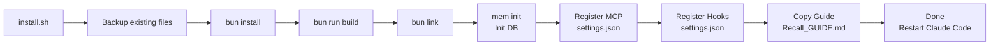

← [Back to README](../README.md)

# Installation

This guide covers everything needed to install Recall: prerequisites, what the installer does, verification, session extraction setup, and environment variables.

---

## Prerequisites

Install these before running `install.sh`. Items marked **Optional** enhance Recall but are not required for core functionality.

**Supported platforms:** macOS 13+ (Apple Silicon and Intel) and Linux (Ubuntu 22.04+, Debian 12+).

---

### Bun (JavaScript runtime)

Recall uses Bun for TypeScript execution and `bun:sqlite` for the database. Minimum version: **1.0+**.

```bash
# macOS (Homebrew)
brew install oven-sh/bun/bun

# Linux / macOS (curl)
curl -fsSL https://bun.sh/install | bash
source ~/.bashrc   # or: source ~/.zshrc on macOS
```

Verify: `bun --version` — [bun.sh](https://bun.sh)

---

### Node.js and npm

Required for global linking so `mem` and `mem-mcp` are available on your PATH. Minimum version: **Node 18+**.

```bash
# macOS (Homebrew)
brew install node

# Linux (Ubuntu/Debian — via NodeSource)
curl -fsSL https://deb.nodesource.com/setup_22.x | sudo -E bash -
sudo apt-get install -y nodejs

# Any platform (nvm)
curl -o- https://raw.githubusercontent.com/nvm-sh/nvm/v0.40.0/install.sh | bash
nvm install --lts
```

Verify: `node --version` — [nodejs.org](https://nodejs.org)

---

### Claude Code

Recall is an extension for Claude Code. You need a working Claude Code installation with an active Anthropic API subscription or Claude Pro/Max plan.

```bash
# macOS / Linux
npm install -g @anthropic-ai/claude-code
```

Verify: `claude --version` — [docs.anthropic.com](https://docs.anthropic.com/en/docs/claude-code)

---

### Fabric (Optional — recommended)

Fabric provides the `extract_wisdom` pattern used for rich Library of Alexandria (LoA) entries. Recall falls back to an inline prompt if Fabric is not available, but Fabric extractions are higher quality. Requires **Go 1.22+**.

```bash
# macOS / Linux (Go required)
go install github.com/danielmiessler/fabric@latest
fabric --setup
```

Verify: `echo "test" | fabric --pattern extract_wisdom` — [github.com/danielmiessler/fabric](https://github.com/danielmiessler/fabric)

---

### Ollama (Optional — enables semantic search)

Vector embeddings enable semantic search: finding related content even when exact keywords do not match. Without Ollama, Recall uses keyword search only (FTS5), which works well for most queries.

Model: `nomic-embed-text` — 768-dimension embeddings, approximately 270 MB.

```bash
# macOS (Homebrew)
brew install ollama
ollama pull nomic-embed-text

# Linux (curl)
curl -fsSL https://ollama.ai/install.sh | sh
ollama pull nomic-embed-text
```

Verify: `curl http://localhost:11434/api/tags` — [ollama.ai](https://ollama.ai)

Set `OLLAMA_URL` if Ollama runs on a different host (default: `http://localhost:11434`).

---

## Install Recall

Clone the repository to a permanent directory (not `/tmp`), then run the installer:

```bash
git clone https://github.com/edheltzel/Recall.git
cd Recall
./install.sh
```

> **Note:** Do not clone to a temporary directory. `bun link` creates symlinks back to the clone location — if the directory is removed (e.g. on reboot), `mem` commands will break.

The installer auto-detects your OS (macOS or Linux) and runs these steps:

| Step | What happens |
|------|-------------|
| 1. Backup | Backs up any existing Claude Code config files (`.mcp.json`, `.claude.json`, `CLAUDE.md`, `settings.json`, `memory.db`) to `~/.claude/backups/recall/` |
| 2. Dependencies | Installs dependencies via `bun install` |
| 3. Build | Compiles TypeScript source via `tsup` |
| 4. Link | Links `mem` and `mem-mcp` globally via `bun link` (falls back to `npm link` on failure) |
| 5. Init DB | Initializes the SQLite database at `~/.claude/memory.db` and creates `~/.claude/MEMORY/` |
| 6. Register MCP | Registers the `recall-memory` MCP server in `~/.claude/settings.json` at user scope (available in all projects) |
| 7. Setup hooks | Copies `SessionExtract.ts` and `BatchExtract.ts` to `~/.claude/hooks/`, copies `hooks/lib/` (shared hook libraries) to `~/.claude/hooks/lib/`, and registers the `Stop` hook in `~/.claude/settings.json` |
| 8. Copy guide | Copies `FOR_CLAUDE.md` to `~/.claude/Recall_GUIDE.md` and installs slash commands to `~/.claude/commands/recall/` |
| 9. Update CLAUDE.md | Appends a MEMORY section to `~/.claude/CLAUDE.md` with core usage rules |

**After install:** Restart Claude Code to load the MCP server and hooks.

---

## Installation Flow



---

## Verify Installation

After the installer completes and you have restarted Claude Code, run these checks:

```bash
which mem mem-mcp          # Both CLIs should resolve to a path
ls -la ~/.claude/memory.db # Database file should exist
mem stats                  # Should return record counts (zeros on fresh install)
mem doctor                 # Full health check — database, MCP, hooks, embeddings
```

`mem doctor` is the authoritative health check. Run it first any time something seems wrong.

---

## Session Extraction

Session extraction runs automatically after every Claude Code session ends. No manual steps are required.

When a session ends, the `Stop` hook triggers `SessionExtract.ts`, which:

1. Reads the session's JSONL conversation file from `~/.claude/projects/`
2. Extracts the text content (skipping tool results and thinking blocks)
3. Sends the text to Claude Haiku for structured extraction
4. Applies a quality gate — rejects extractions missing required sections
5. Appends results to six memory files in `~/.claude/MEMORY/` (full archive, hot recall, session index, decisions, rejections, error patterns)
6. Tracks extraction state per-file to prevent duplicates and enable 24-hour retries

If the Anthropic API is unavailable, the hook falls back to a local Ollama model. Set `Recall_OLLAMA_MODEL` to change which model is used (default: `qwen2.5:3b`).

The hook self-spawns in the background so the session exits immediately — extraction is non-blocking.

### Optional: Batch Extraction (cron)

The `BatchExtract.ts` script catches any sessions that the `Stop` hook missed (e.g. if Claude Code was force-quit). Set it up as a cron job:

```bash
crontab -e
# Add this line (runs every 30 minutes):
*/30 * * * * ~/.bun/bin/bun run ~/.claude/hooks/BatchExtract.ts --limit 20 >> /tmp/recall-batch.log 2>&1
```

---

## Environment Variables

| Variable | Default | Purpose |
|----------|---------|---------|
| `MEM_DB_PATH` | `~/.claude/memory.db` | SQLite database file location |
| `OLLAMA_URL` | `http://localhost:11434` | Ollama server URL for vector embeddings |
| `EMBEDDING_MODEL` | `nomic-embed-text` | Ollama model used for embeddings (768-dim) |
| `Recall_OLLAMA_MODEL` | `qwen2.5:3b` | Ollama model used for extraction when Anthropic API is unavailable |
| `RECALL_BASE_DIR` | `~/.claude` | Base directory for document imports |

Set these in your shell profile (`~/.bashrc`, `~/.zshrc`, `~/.config/fish/config.fish`) if you need non-default values. The `MEM_DB_PATH` variable is the most commonly changed — useful if you want to keep the database outside `~/.claude`.

---

## Backup and Restore

The installer automatically creates a timestamped backup before making any changes. Backups are stored at `~/.claude/backups/recall/`.

```bash
./install.sh list              # List available backups
./install.sh restore           # Restore from most recent backup
./install.sh restore 20260219  # Restore a specific backup by timestamp
```

Manual database backup:
```bash
cp ~/.claude/memory.db ~/.claude/memory.db.backup
```

---

*Next: [CLI Reference](cli-reference.md) | [MCP Tools](mcp-tools.md) | [Troubleshooting](troubleshooting.md)*
