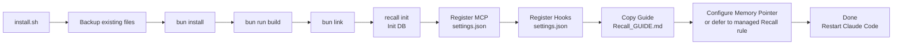

← [Back to README](../README.md)

# Installation

This guide covers everything needed to install Recall: prerequisites, what the installer does, verification, session extraction setup, and environment variables.

> **Not sure which command to run** (install vs. update vs. uninstall, npm vs. source, re-install, custom DB path, recovery)? See **[Managing Recall — which command do I run?](lifecycle.md)** for the decision table.

---

## Prerequisites

Install these before running `install.sh`. Items marked **Optional** enhance Recall but are not required for core functionality.

**Supported platforms:** macOS 13+ (Apple Silicon and Intel) and Linux (Ubuntu 22.04+, Debian 12+).

---

### Bun (JavaScript runtime)

Recall uses Bun for TypeScript execution and `bun:sqlite` for the database. Minimum version: **1.0+**.

```bash
# macOS (Homebrew)
brew install oven-sh/bun/bun

# Linux / macOS (curl)
curl -fsSL https://bun.sh/install | bash
source ~/.bashrc   # or: source ~/.zshrc on macOS
```

Verify: `bun --version` — [bun.sh](https://bun.sh)

---

### Node.js and npm

Required for global linking so `recall` and `recall-mcp` are available on your PATH. Minimum version: **Node 18+**.

```bash
# macOS (Homebrew)
brew install node

# Linux (Ubuntu/Debian — via NodeSource)
curl -fsSL https://deb.nodesource.com/setup_22.x | sudo -E bash -
sudo apt-get install -y nodejs

# Any platform (nvm)
curl -o- https://raw.githubusercontent.com/nvm-sh/nvm/v0.40.0/install.sh | bash
nvm install --lts
```

Verify: `node --version` — [nodejs.org](https://nodejs.org)

---

### Claude Code

Recall is an extension for Claude Code. You need a working Claude Code installation with an active Anthropic API subscription or Claude Pro/Max plan.

```bash
# macOS / Linux
npm install -g @anthropic-ai/claude-code
```

Verify: `claude --version` — [docs.anthropic.com](https://docs.anthropic.com/en/docs/claude-code)

---

### Fabric (Optional — recommended)

Fabric provides the `extract_wisdom` pattern used for rich Library of Alexandria (LoA) entries. Recall falls back to an inline prompt if Fabric is not available, but Fabric extractions are higher quality. Requires **Go 1.22+**.

```bash
# macOS / Linux (Go required)
go install github.com/danielmiessler/fabric@latest
fabric --setup
```

Verify: `echo "test" | fabric --pattern extract_wisdom` — [github.com/danielmiessler/fabric](https://github.com/danielmiessler/fabric)

---

### Ollama (Optional — enables semantic search)

Vector embeddings enable semantic search: finding related content even when exact keywords do not match. Without Ollama, Recall uses keyword search only (FTS5), which works well for most queries.

Model: `qwen3-embedding:0.6b` — 1024-dimension embeddings, approximately 640 MB.

```bash
# macOS (Homebrew)
brew install ollama
ollama pull qwen3-embedding:0.6b

# Linux (curl)
curl -fsSL https://ollama.ai/install.sh | sh
ollama pull qwen3-embedding:0.6b
```

Verify: `curl http://localhost:11434/api/tags` — [ollama.ai](https://ollama.ai)

Set `OLLAMA_URL` if Ollama runs on a different host (default: `http://localhost:11434`).

---

## Install Recall

Clone the repository to a permanent directory (not `/tmp`), then run the installer:

```bash
git clone https://github.com/edheltzel/Recall.git
cd Recall
./install.sh
```

> **Note:** Do not clone to a temporary directory. `bun link` creates symlinks back to the clone location — if the directory is removed (e.g. on reboot), `recall` commands will break.

The installer auto-detects your OS (macOS or Linux) and runs these steps:

| Step | What happens |
|------|-------------|
| 1. Backup | Backs up any existing Claude Code config files (`.mcp.json`, `.claude.json`, `CLAUDE.md`, `settings.json`, `recall.db`) to `~/.claude/backups/recall/` |
| 2. Dependencies | Installs dependencies via `bun install` |
| 3. Build | Compiles TypeScript source via `tsup` |
| 4. Link | Links `recall` and `recall-mcp` globally via `bun link` (falls back to `npm link` on failure) |
| 5. Init DB | Initializes the SQLite database at `~/.agents/Recall/recall.db` and creates `~/.claude/MEMORY/` |
| 6. Register MCP | Registers the `recall-memory` MCP server in `~/.claude/settings.json` at user scope (available in all projects) |
| 7. Setup hooks | Copies `RecallExtract.ts` and `RecallBatchExtract.ts` to `~/.claude/hooks/`, copies `hooks/lib/` (shared hook libraries) to `~/.claude/hooks/lib/`, and registers the `Stop` hook in `~/.claude/settings.json` |
| 8. Copy guide | Copies `FOR_CLAUDE.md` to `~/.claude/Recall_GUIDE.md` and installs agent skills to `~/.claude/skills/recall-*/` (removing any legacy `~/.claude/commands/Recall/` symlinks) |
| 9. Configure Claude memory | If no Recall-specific `~/.claude/rules/memory.md` owns the contract, adds a marked, syntax-free `Recall_GUIDE.md` pointer when `CLAUDE.md` has no `## MEMORY`; refreshes marked sections and migrates normalized exact legacy-generated bodies; preserves unmarked customized/external sections. Remove the marker before taking external ownership. `update.sh` runs the same migration during runtime refresh |

**After install:** Restart Claude Code to load the MCP server and hooks.

---

## Installation Flow



---

## Verify Installation

After the installer completes and you have restarted Claude Code, run these checks:

```bash
which recall recall-mcp          # Both CLIs should resolve to a path
ls -la ~/.agents/Recall/recall.db # Database file should exist
recall stats                  # Should return record counts (zeros on fresh install)
recall doctor                 # Full health check — database, MCP, hooks, embeddings
```

`recall doctor` is the authoritative health check. Run it first any time something seems wrong.

### Recommended: seed your L0 identity tier

Recall's `RecallStart` hook injects a small user-authored identity file at
the top of every session (the L0 tier). Without it, the L0 section is empty
and the v2 tiered context is only half-populated.

```bash
recall onboard                 # Interactive 7-question interview
recall onboard --print --yes   # Preview what would be written (no side effects)
```

This writes `~/.claude/MEMORY/identity.md` (global) or
`./.atlas-recall/identity.md` (project-local with `--project`). Files
exceeding 1200 characters are silently truncated at load; the command
warns if your rendered output exceeds that limit.

---

## Session Extraction

Session extraction runs automatically after every Claude Code session ends. No manual steps are required.

When a session ends, the `Stop` hook triggers `RecallExtract.ts`, which:

1. Reads the session's JSONL conversation file from `~/.claude/projects/`
2. Extracts the text content (skipping tool results and thinking blocks)
3. Sends the text to Claude Haiku for structured extraction
4. Applies a quality gate — rejects extractions missing required sections
5. Appends results to six memory files in `~/.claude/MEMORY/` (full archive, hot recall, session index, decisions, rejections, error patterns)
6. Tracks extraction state per-file to prevent duplicates and enable 24-hour retries

If the Anthropic API is unavailable, the hook falls back to a local Ollama model. Set `Recall_OLLAMA_MODEL` to change which model is used (default: `qwen2.5:3b`).

The hook self-spawns in the background so the session exits immediately — extraction is non-blocking.

### Optional: Batch Extraction (cron)

The `RecallBatchExtract.ts` script catches any sessions that the `Stop` hook missed (e.g. if Claude Code was force-quit). Set it up as a cron job:

```bash
crontab -e
# Add this line (runs every 30 minutes):
*/30 * * * * ~/.bun/bin/bun run ~/.claude/hooks/RecallBatchExtract.ts --limit 20 >> /tmp/recall-batch.log 2>&1
```

---

## Environment Variables

| Variable | Default | Purpose |
|----------|---------|---------|
| `RECALL_DB_PATH` | `~/.agents/Recall/recall.db` | SQLite database file location (primary) |
| `MEM_DB_PATH` | _(unset)_ | SQLite database file location — **deprecated**, honored as a fallback when `RECALL_DB_PATH` is not set. Existing installs continue to work; new installs should use `RECALL_DB_PATH`. |
| `RECALL_IDENTITY_PATH` | — | Override the L0 identity file path. Takes precedence over both project-local (`./.atlas-recall/identity.md`) and global (`~/.claude/MEMORY/identity.md`). Honored by both `RecallStart` (read) and `recall onboard` (write). |
| `OLLAMA_URL` | `http://localhost:11434` | Ollama server URL for vector embeddings |
| `EMBEDDING_MODEL` | `qwen3-embedding:0.6b` | Ollama model used for embeddings (1024-dim) |
| `Recall_OLLAMA_MODEL` | `qwen2.5:3b` | Ollama model used for extraction when Anthropic API is unavailable |
| `RECALL_BASE_DIR` | `~/.claude` | Base directory for document imports |
| `RECALL_NO_GUM` | `0` | Set to `1` to skip the optional [`gum`](https://github.com/charmbracelet/gum) auto-install and use the bash UI for installer/update/uninstall. Same effect as the `--no-gum` flag, but persistent across all runs. |
| `RECALL_VERBOSE` | `0` | Set to `1` to bypass output capture for `bun install` / `bun run build` (useful when debugging install failures). |
| `NO_COLOR` | — | Standard; set to `1` to disable ANSI colors across all installer scripts. |

Set these in your shell profile (`~/.bashrc`, `~/.zshrc`, `~/.config/fish/config.fish`) if you need non-default values. The `RECALL_DB_PATH` variable is the most commonly changed — useful if you want to keep the database outside `~/.agents/Recall/`. You can also pass `--db-path /custom/path/recall.db` to `./install.sh` for non-interactive overrides.

---

## Backup and Restore

The installer automatically creates a timestamped backup before making any changes. Backups are stored at `~/.claude/backups/recall/`.

```bash
./install.sh list              # List available backups
./install.sh restore           # Restore from most recent backup
./install.sh restore 20260219  # Restore a specific backup by timestamp
```

Manual database backup:
```bash
cp ~/.agents/Recall/recall.db ~/.agents/Recall/recall.db.backup
```

---

## Uninstalling

Recall ships an `uninstall.sh` that removes its integration surgically while preserving your memory by default. Exit Claude Code first, then:

```bash
cd /path/to/Recall
./uninstall.sh --dry-run        # preview what will change, touch nothing
./uninstall.sh                  # remove integration; preserve ~/.agents/Recall/ (DB + backups)
./uninstall.sh --purge          # also destroy ~/.agents/Recall/ tree (confirmed)
```

### What gets removed (default)

- `~/.claude/commands/Recall/` (slash commands; legacy `~/.claude/commands/recall/` is also removed if present)
- `~/.claude/Recall_GUIDE.md`
- Recall's hook entries in `~/.claude/settings.json` (Stop/SessionStart/PreCompact) — other hooks are preserved
- `mcpServers["recall-memory"]` in `settings.json` — other MCP servers preserved
- `~/.claude/hooks/{RecallExtract,RecallBatchExtract,RecallTelosSync,RecallStart,RecallPreCompact}.ts`
- `~/.claude/hooks/lib/{extraction-*,pid-utils}.ts` — only Recall-owned files, never the whole `hooks/lib/` directory
- The `## MEMORY` section in `~/.claude/CLAUDE.md` only if Recall generated it (current ownership marker or a normalized exact match of the complete legacy-generated body); unmarked customized/externally owned sections and the rest of `CLAUDE.md` are preserved; a marked section remains Recall-owned even if its body was edited
- `~/.claude/MEMORY/extract_prompt.md` — only if unmodified from source; user-edited versions are preserved
- OpenCode MCP entry + plugins + agent (unless `--skip-opencode`)
- Pi MCP entry + extensions + Recall-generated `AGENTS.md` MEMORY section (current marker or normalized exact legacy Pi body); unmarked customized/external Pi sections survive, while marked sections remain Recall-owned (unless `--skip-pi`)
- `bun unlink` (removes `recall` and `recall-mcp` from your PATH)

### What is preserved (default)

- `~/.agents/Recall/recall.db` — your persistent memory database
- `~/.claude/backups/recall/` — the backup tree written by install/update
- `~/.claude/MEMORY/` — identity.md, DISTILLED.md, session subdirs
- This source directory (remove with `rm -rf /path/to/Recall`)

### Flags

| Flag | Purpose |
|------|---------|
| `--dry-run` | Narrate every change, touch nothing |
| `--purge` | Also destroy `recall.db` + backup tree. Requires interactive `PURGE` confirmation. Writes a `pre_purge_<TS>/` snapshot before deleting. |
| `--no-confirm` | Non-interactive (still requires PURGE confirmation for `--purge`) |
| `--skip-opencode` | Leave OpenCode integration alone |
| `--skip-pi` | Leave Pi integration alone |
| `--help` | Show usage |

Even with `--purge`, `~/.claude/MEMORY/` is preserved — it's user-authored content, not Recall-owned state.

---

*Next: [CLI Reference](cli-reference.md) | [MCP Tools](mcp-tools.md) | [Troubleshooting](troubleshooting.md)*
