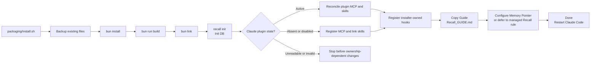

← [Back to README](../README.md)

# Installation

This guide covers everything needed to install Recall: prerequisites, what the installer does, verification, session extraction setup, and environment variables.

> **First run?** Walk through [Getting Started](getting-started.md) for install, first commands, where the database lives, how a session starts, and how MCP/hooks get wired.

> **Not sure which command to run** (install vs. update vs. uninstall, source checkout vs. local tarball, re-install, custom DB path, recovery)? See **[Managing Recall — which command do I run?](lifecycle.md)** for the decision table.

---

## Prerequisites

Install these before the [source checkout](#source-checkout) or a local tarball link, and before `recall install`. Items marked **Optional** enhance Recall but are not required for core functionality.

**Supported platforms:** macOS 13+ (Apple Silicon and Intel) and Linux (Ubuntu 22.04+, Debian 12+).

---

### Bun (JavaScript runtime)

Recall uses Bun for TypeScript execution and `bun:sqlite` for the database. Minimum version: **1.0+**.

```bash
# macOS (Homebrew)
brew install oven-sh/bun/bun

# Linux / macOS (curl)
curl -fsSL https://bun.sh/install | bash
source ~/.bashrc   # or: source ~/.zshrc on macOS
```

Verify: `bun --version` — [bun.sh](https://bun.sh)

---

### Node.js and npm

Required for global linking so `recall` and `recall-mcp` are available on your PATH. Minimum version: **Node 18+**.

```bash
# macOS (Homebrew)
brew install node

# Linux (Ubuntu/Debian — via NodeSource)
curl -fsSL https://deb.nodesource.com/setup_22.x | sudo -E bash -
sudo apt-get install -y nodejs

# Any platform (nvm)
curl -o- https://raw.githubusercontent.com/nvm-sh/nvm/v0.40.0/install.sh | bash
nvm install --lts
```

Verify: `node --version` — [nodejs.org](https://nodejs.org)

---

### Claude Code

Recall is an extension for Claude Code. You need a working Claude Code installation with an active Anthropic API subscription or Claude Pro/Max plan.

```bash
# macOS / Linux
npm install -g @anthropic-ai/claude-code
```

Verify: `claude --version` — [docs.anthropic.com](https://docs.anthropic.com/en/docs/claude-code)

**Preferred attach** is the native plugin, not this installer: see [Claude Integration](CLAUDE_INTEGRATION.md). The installer still owns Claude lifecycle hooks.

### OpenCode (Optional)

If OpenCode is installed, Recall registers its MCP entry and native plugins.
The integration requires the supported `opencode` CLI and Bun on `PATH`; the
plugin uses `opencode export <session-id>` (JSON) and converts the result into a
markdown drop for the shared batch extractor. Verify with `opencode --version`.
Use `./packaging/install.sh --skip-opencode` when OpenCode should remain untouched.

### Grok Build CLI (Optional)

If `grok` is installed, Recall adds the managed user-level lifecycle hook documented in [Grok Integration](GROK_INTEGRATION.md). The hook exports completed sessions through the public Grok CLI and writes them immediately to `recall.db`. It does not add automatic session-start injection.

Verify with `grok --version`. Deselect Grok in the interactive installer when it should remain untouched. Grok has no working plugin/extension install path; this installer is the only supported attach. See [Grok Integration](GROK_INTEGRATION.md).

**Claude Code, Codex, Pi, and omp** prefer their native plugin/extension. omp capture is a separate native package attach; the installer only owns its skill links. **Cursor** stays snippets under `templates/cursor/` with no marketplace plugin. See the [README Quick Start](../README.md#quick-start), [Codex Integration](CODEX_INTEGRATION.md), [Pi Integration](PI_INTEGRATION.md), [omp Integration](OMP_INTEGRATION.md), and [JCode Integration](JCODE_INTEGRATION.md).

---

### Fabric (Optional — recommended)

Fabric is the `fabric` Extractor for Curated LoA (`recall loa`, dump extract). Automatic-capture LoA does not use Fabric. Requires **Go 1.22+**.

```bash
# macOS / Linux (Go required)
go install github.com/danielmiessler/fabric@latest
fabric --setup
```

Verify: `echo "test" | fabric --pattern extract_wisdom` — [github.com/danielmiessler/fabric](https://github.com/danielmiessler/fabric)

---

### Ollama (Optional — enables semantic search)

Vector embeddings enable semantic search: finding related content even when exact keywords do not match. Without Ollama, Recall uses keyword search only (FTS5), which works well for most queries.

Model: `qwen3-embedding:0.6b` — 1024-dimension embeddings, approximately 640 MB.

```bash
# macOS (Homebrew)
brew install ollama
ollama pull qwen3-embedding:0.6b

# Linux (curl)
curl -fsSL https://ollama.ai/install.sh | sh
ollama pull qwen3-embedding:0.6b
```

Verify: `curl http://localhost:11434/api/tags` — [ollama.ai](https://ollama.ai)

Set `OLLAMA_URL` if Ollama runs on a different host (default: `http://localhost:11434`).

---

## Install Recall

Recall has one install root: `~/.agents/Recall`. The runtime tree is not
relocatable. `RECALL_DB_PATH`, `recall install --db-path`, and `./packaging/install.sh --db-path` may place the SQLite
database elsewhere; they do not move the install root.

Recall is not on the npm registry yet; the `recall-memory` package there is an unrelated project (see #312). Canonical install:

```bash
git clone https://github.com/edheltzel/Recall.git && cd Recall && ./packaging/install.sh
```

That script runs `bun install`, the build, and links `recall` / `recall-mcp`, then installer-owned setup. Updates: `recall update` (git checkout pulls). Claude Code should follow [Source checkout](#source-checkout) and attach the plugin before `./packaging/install.sh`.

Global binary from a local tarball (from the checkout):

```bash
bun run build && npm pack --pack-destination <dir>
bun install -g <dir>/recall-memory-<version>.tgz
recall init
```

Then `recall install`. Next attach the host's native plugin or extension from the [README Quick Start](../README.md#quick-start). For Claude Code, install the plugin before running `recall install` for lifecycle hooks so the installer reconciles duplicate MCP and skill surfaces. Grok and detected hosts without a native attach use `recall install` directly. In packaged (tarball) mode it runs `packaging/install.sh` with `RECALL_PACKAGED=1`, skipping clone, `bun install`, build, and link.

### Source checkout

Clone into a permanent directory, not `/tmp`. This directory is also the local marketplace root:

```bash
git clone https://github.com/edheltzel/Recall.git
cd Recall
```

Claude Code users must attach the native plugin before installer-owned setup:

```bash
claude plugin marketplace add "$PWD"
claude plugin install recall@recall-marketplace
```

Other hosts skip those two Claude-only commands. Then run the installer:

```bash
./packaging/install.sh
```

> **Note:** Do not clone to a temporary directory. `bun link` creates symlinks back to the clone location — if the directory is removed (e.g. on reboot), `recall` commands will break.

The installer auto-detects your OS (macOS or Linux) and runs these steps:

| Step | What happens |
|------|-------------|
| 1. Backup | Backs up any existing Claude Code config files (`.mcp.json`, `.claude.json`, `CLAUDE.md`, `settings.json`, `recall.db`) to `~/.agents/Recall/backups/` |
| 2. Dependencies | Installs dependencies via `bun install` |
| 3. Build | Compiles TypeScript source via `tsup` |
| 4. Link | Links `recall` and `recall-mcp` globally via `bun link` (falls back to `npm link` on failure) |
| 5. Init DB | Initializes the SQLite database at `~/.agents/Recall/recall.db` and creates `~/.claude/MEMORY/` |
| 6. Configure MCP | With an active Claude plugin, preserves a stored custom pin unless an explicit `--db-path` or inherited `RECALL_DB_PATH`/`MEM_DB_PATH` replaces it; if the selected path is the default, removes the user registration so the plugin serves that database. When the plugin is confirmed absent or disabled, registers `recall-memory` in `~/.claude/settings.json` at user scope |
| 7. Setup hooks | Copies the installer-owned Claude hooks and shared hook libraries to their canonical runtime paths, links them into `~/.claude/hooks/`, and registers the current Claude lifecycle events through the shared hook installer |
| 8. Copy guide and skills | Copies `FOR_CLAUDE.md` to `~/.claude/Recall_GUIDE.md`; the active Claude plugin owns skills, while a confirmed absent or disabled plugin makes the installer link them under `~/.claude/skills/do-recall-*/`. Removes legacy `~/.claude/commands/Recall/` symlinks |
| 9. Configure Claude memory | If no Recall-specific `~/.claude/rules/memory.md` owns the contract, adds a marked, syntax-free `Recall_GUIDE.md` pointer when `CLAUDE.md` has no `## MEMORY`; refreshes marked sections and migrates normalized exact legacy-generated bodies; preserves unmarked customized/external sections. Remove the marker before taking external ownership. `update.sh` runs the same migration during runtime refresh |
| 10. Configure detected hosts | Refreshes existing OpenCode and Pi integrations and installs Grok's managed automatic-capture hook when those CLIs are detected |

**After install:** Restart each configured host to load its integration.

Claude plugin ownership detection fails closed. If its state files are unreadable or invalid, the installer returns an error before ownership-dependent skill or MCP changes. See [Claude Code Integration](CLAUDE_INTEGRATION.md#hooks-and-the-installer-required-for-automatic-capture) for the state rules and recovery.

---

## Installation Flow


```mermaid
flowchart LR
    A[packaging/install.sh] --> B[Backup existing files]
    B --> C[bun install]
    C --> D[bun run build]
    D --> E[bun link]
    E --> F[recall init\nInit DB]
    F --> G{Claude plugin state?}
    G -->|Active| H[Reconcile plugin MCP and skills]
    G -->|Absent or disabled| I[Register MCP and link skills]
    G -->|Unreadable or invalid| X[Stop before ownership-dependent changes]
    H --> J[Register installer-owned hooks]
    I --> J
    J --> K[Copy Guide\nRecall_GUIDE.md]
    K --> L[Configure Memory Pointer\nor defer to managed Recall rule]
    L --> M[Done\nRestart Claude Code]
```

---

## Verify Installation

After the installer completes and you have restarted Claude Code, run these checks:

```bash
which recall recall-mcp          # Both CLIs should resolve to a path
ls -la ~/.agents/Recall/recall.db # Database file should exist
recall stats                  # Should return record counts (zeros on fresh install)
recall doctor                 # Full health check — database, MCP, hooks, embeddings
```

`recall doctor` is the authoritative health check. Run it first any time something seems wrong.

### Recommended: seed your L0 identity tier

Recall's supported session-start integrations inject a small user-authored
identity file at the top of a session (the L0 tier). Without it, the L0 section is empty
and the v2 tiered context is only half-populated.

```bash
recall onboard                 # Interactive 7-question interview
recall onboard --print --yes   # Preview what would be written (no side effects)
```

Global onboarding uses the same resolver as `RecallStart`. An existing
user-owned `~/.claude/MEMORY/identity.md` remains authoritative; otherwise
the path is the canonical file under the Recall install root,
`~/.agents/Recall/MEMORY/identity.md`. A managed Claude link, when present,
exposes that same canonical file.
`--project` instead writes `./.atlas-recall/identity.md`. Files exceeding
1200 characters are silently truncated at load; the command warns if your
rendered output exceeds that limit.

---

## Session Extraction

Session extraction runs automatically after every Claude Code session ends. No manual steps are required.

When a session ends, the `Stop` hook triggers `RecallExtract.ts`, which:

1. Reads the session's JSONL conversation file from `~/.claude/projects/`
2. Extracts the text content (skipping tool results and thinking blocks)
3. Runs the Automatic-capture Extractor (default `claude-cli`, then `ollama`, unless `extraction.automatic` is set)
4. Applies a quality gate — rejects extractions missing required sections
5. Appends results to six memory files in `~/.claude/MEMORY/` (full archive, hot recall, session index, decisions, rejections, error patterns)
6. Tracks extraction state per-file to prevent duplicates and enable 24-hour retries

If `claude-cli` is unavailable, the hook falls back to a local Ollama model. Set `Recall_OLLAMA_MODEL` to change which model is used (default: `qwen2.5:3b`). A present `extraction.automatic` list replaces that cascade. A missing key keeps it. See [architecture](architecture.md#harness-steps). `OLLAMA_URL` is the shared Ollama endpoint (embeddings and automatic `ollama` Extractor).

The hook self-spawns in the background so the session exits immediately — extraction is non-blocking.

### Optional: Batch Extraction (cron)

The `RecallBatchExtract.ts` script catches any sessions that the `Stop` hook missed (e.g. if Claude Code was force-quit). Set it up as a cron job:

```bash
crontab -e
# Add this line (runs every 30 minutes):
*/30 * * * * ~/.bun/bin/bun run ~/.claude/hooks/RecallBatchExtract.ts --limit 20 >> /tmp/recall-batch.log 2>&1
```

---

## Environment Variables

| Variable | Default | Purpose |
|----------|---------|---------|
| `RECALL_DB_PATH` | `~/.agents/Recall/recall.db` | SQLite database file location (primary) |
| `MEM_DB_PATH` | _(unset)_ | SQLite database file location — **deprecated**, honored as a fallback when `RECALL_DB_PATH` is not set. Existing installs continue to work; new installs should use `RECALL_DB_PATH`. |
| `RECALL_IDENTITY_PATH` | — | Override the L0 identity file path. First in the shared resolver used by both `RecallStart` (read) and `recall onboard` (write); see [Identity & Onboarding](cli-reference.md#identity--onboarding). |
| `OLLAMA_URL` | `http://localhost:11434` | Shared Ollama server URL (embeddings and automatic `ollama` Extractor) |
| `EMBEDDING_MODEL` | `qwen3-embedding:0.6b` | Ollama model used for embeddings (1024-dim) |
| `Recall_OLLAMA_MODEL` | `qwen2.5:3b` | Ollama model for the automatic Extractor |
| `RECALL_FABRIC_MODEL` | `claude-haiku-4-5` | Fabric `-m` model for Curated LoA |
| `JEV_RECALL_KEY` | _(unset)_ | Optional. Structured extraction scores decisions, learnings, and breadcrumbs when this is set in that process. Missing or blank skips scoring and still writes those rows. `recall capture` does not use it. Recall does not read `~/.env`. See [Score one memory item with Jev](score-a-memory-with-jev.md). |
| `RECALL_BASE_DIR` | `~/.claude` | Base directory for document imports |
| `RECALL_NO_GUM` | `0` | Set to `1` to skip the optional [`gum`](https://github.com/charmbracelet/gum) auto-install and use the bash UI for installer/update/uninstall. Same effect as the `--no-gum` flag, but persistent across all runs. |
| `RECALL_VERBOSE` | `0` | Set to `1` to bypass output capture for `bun install` / `bun run build` (useful when debugging install failures). |
| `NO_COLOR` | — | Standard; set to `1` to disable ANSI colors across all installer scripts. |

Set these in your shell profile (`~/.bashrc`, `~/.zshrc`, `~/.config/fish/config.fish`) if you need non-default values. The `RECALL_DB_PATH` variable is the most commonly changed — useful if you want to keep the database outside `~/.agents/Recall/`. You can also pass `--db-path /custom/path/recall.db` to `./packaging/install.sh` for non-interactive overrides.

---

## Backup and Restore

The installer automatically creates a timestamped backup before making any changes. Backups are stored at `~/.agents/Recall/backups/`.

```bash
./packaging/install.sh list              # List available backups
./packaging/install.sh restore           # Restore from most recent backup
./packaging/install.sh restore 20260219  # Restore a specific backup by timestamp
```

Manual database backup:
```bash
cp ~/.agents/Recall/recall.db ~/.agents/Recall/recall.db.backup
```

---

## Uninstalling

Recall ships an `uninstall.sh` that removes its integration surgically while preserving your memory by default. Exit Claude Code first, then:

```bash
cd /path/to/Recall
./packaging/uninstall.sh --dry-run        # preview what will change, touch nothing
./packaging/uninstall.sh                  # remove integration; preserve ~/.agents/Recall/ (DB + backups)
./packaging/uninstall.sh --purge          # also destroy ~/.agents/Recall/ tree (confirmed)
```

### What gets removed (default)

- Recall-managed slash-command symlinks under `~/.claude/commands/Recall/` and legacy `~/.claude/commands/recall/`; either directory is removed only when empty
- Recall-managed Agent Skill symlinks under `~/.claude/skills/do-recall-*/` and `~/.omp/agent/skills/do-recall-*/` (unless `--skip-omp` for omp); real files and foreign links are preserved
- `~/.claude/Recall_GUIDE.md`
- Recall's hook entries in `~/.claude/settings.json` (Stop/SessionStart/PreCompact/PostToolUse/UserPromptSubmit) — other hooks are preserved
- `mcpServers["recall-memory"]` in `settings.json` — other MCP servers preserved
- Recall-owned hook files under `~/.claude/hooks/`, including `RecallInSession.ts`, and installed TypeScript helpers under `~/.claude/hooks/lib/` — only inventoried Recall paths, never either whole directory
- The `## MEMORY` section in `~/.claude/CLAUDE.md` only if Recall generated it (current ownership marker or a normalized exact match of the complete legacy-generated body); unmarked customized/externally owned sections and the rest of `CLAUDE.md` are preserved; a marked section remains Recall-owned even if its body was edited
- `~/.claude/MEMORY/extract_prompt.md` — only if unmodified from source; user-edited versions are preserved
- OpenCode MCP entry + plugins + the shared plugin helpers Recall installs under `plugins/lib/` + agent + guide (unless `--skip-opencode`). `plugins/lib/` itself is removed only when Recall emptied it, so your own files there survive. An `opencode.json` that Recall cannot parse is reported and left untouched; the plugins, agent, and guide are still removed and the rest of the uninstall continues
- Recall's native Pi package registration, owned Pi MCP entry, guide link, and Recall-generated `AGENTS.md` MEMORY section (current marker or normalized exact legacy Pi body); legacy Recall extension/skill links are removed, while unrelated Pi packages and `pi-mcp-adapter` remain (unless `--skip-pi`)
- The managed Grok lifecycle symlink at `~/.grok/hooks/RecallLifecycle.json`; a foreign file at that path is preserved (unless `--skip-grok`)
- `bun unlink` (removes `recall` and `recall-mcp` from your PATH)

If direct cleanup cannot safely parse an owned Claude, OpenCode, or Pi config, it does not rewrite that file, completes the other safe cleanup, and exits nonzero with `Uninstall Incomplete`.

Separately installed omp capture is removed with `omp plugin uninstall recall-memory`, followed by an omp restart. The lifecycle uninstaller does not manage that native plugin registration.

### What is preserved (default)

- `~/.agents/Recall/recall.db` — your persistent memory database
- `~/.agents/Recall/backups/` — the backup tree written by install/update
- User-authored identity and distilled memory under `~/.agents/Recall/MEMORY/`, together with any managed Claude links or legacy files in `~/.claude/MEMORY/`
- This source directory (remove with `rm -rf /path/to/Recall`)

### Flags

| Flag | Purpose |
|------|---------|
| `--dry-run` | Narrate every change, touch nothing |
| `--purge` | Destroy `recall.db`, runtime files, and the old backup tree. Requires interactive `PURGE` confirmation. The `pre_purge_<TS>/` snapshot retains the database plus canonical `identity.md`/`DISTILLED.md`; those user files are also materialized into `~/.claude/MEMORY/` when that does not overwrite a foreign file. |
| `--no-confirm` | Non-interactive (still requires PURGE confirmation for `--purge`) |
| `--skip-opencode` | Leave OpenCode integration alone |
| `--skip-pi` | Leave Pi integration alone |
| `--skip-grok` | Leave Grok lifecycle capture alone |
| `--skip-omp` | Leave omp Agent Skills alone |
| `--no-gum` | Skip optional gum setup and use the bash interface for this run |
| `--help` | Show usage |

Even with `--purge`, user-authored identity and distilled memory are retained.
An existing foreign Claude file is never overwritten; the canonical Recall
copy remains available in the pre-purge snapshot.

---

*Next: [Getting Started](getting-started.md) | [CLI Reference](cli-reference.md) | [MCP Tools](mcp-tools.md) | [Troubleshooting](troubleshooting.md)*
