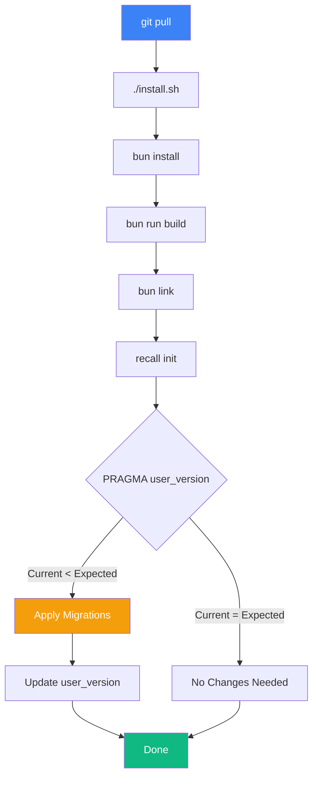

# Upgrading

[← Back to README](../README.md)

## Migration note: `/Recall:*` slash commands → `recall-*` Agent Skills

The `/Recall:*` Claude Code slash commands were retired in favor of [Agent Skills](agent-skills.md) (issue #228) — same bodies, one `recall-*` namespace across Claude Code, Pi, and omp. `install.sh` / `update.sh` remove the stale `~/.claude/commands/Recall/` symlinks automatically on the next run.

One thing the installer can't reach: **your own files**. If a personal rules file (e.g. `~/.claude/rules/memory.md`) or project doc references `/Recall:dump` or another `/Recall:*` command, update it to the `/recall-*` form by hand.

## Check for a new release

From inside Claude Code:

```
/recall-update
```

This is a **check-only** command — it prints the current vs. latest
version and the exact command to run. It never rebuilds mid-session
(that would corrupt hooks tied to the running `recall` binary).

From a shell:

```bash
cd /path/to/Recall
./update.sh --check
```

## Using `update.sh` (recommended)

Exit Claude Code first, then:

```bash
cd /path/to/Recall
./update.sh
```

`update.sh` performs the full lifecycle:

1. Fetches the latest release tag from GitHub and compares to
   `package.json`. Exits 0 if already current (unless `--force`).
2. Creates a timestamped backup of `settings.json`, `recall.db`,
   `CLAUDE.md`, OpenCode/Pi configs, and `.mcp.json` at
   `~/.claude/backups/recall/<TIMESTAMP>/`. Records the git `PRE_SHA`
   in the manifest.
3. `git fetch --tags && git pull --ff-only origin main` (aborts on a
   dirty tree; resolve manually and re-run).
4. `bun install && bun run build`.
5. `recall init` applies any pending SQLite migrations
   (`PRAGMA user_version`-driven, non-destructive).
6. Copies refreshed hooks, shared lib files, agent skills, and
   `FOR_CLAUDE.md`; refreshes detected host integrations; and runs the shared
   Claude/Pi `## MEMORY` ownership migration. Marked sections and normalized
   exact legacy-generated bodies become syntax-free `Recall_GUIDE.md` pointers;
   unmarked customized/external sections are preserved, while marked sections
   remain Recall-owned. A Recall-specific `~/.claude/rules/memory.md` leaves
   `CLAUDE.md` unchanged.
   `extract_prompt.md` gets a drift check — if you edited it, the new version
   lands at `extract_prompt.md.new` and your edits are preserved.
7. Forces re-registration of all four hooks (RecallExtract,
   RecallTelosSync, RecallStart, RecallPreCompact) — this permanently
   prevents the pre-0.7.1 bug class where a partial install could
   leave hooks missing.
8. Verifies via `recall --version` and `recall stats`.

### Update flags

| Flag | Purpose |
|------|---------|
| `--check` | Version check only; print recipe and exit |
| `--dry-run` | Narrate every step with `[dry-run]` markers, touch nothing |
| `--force` | Run even if already at latest (repair path) |
| `--no-migrate` | Skip `recall init` migration step |
| `--no-confirm` | Non-interactive |
| `--help` | Show usage |

### Rollback

If `update.sh` fails at any step, it writes a rollback recipe to
`~/.claude/backups/recall/<TIMESTAMP>/ROLLBACK.txt` with the exact
commands to revert:

```
git reset --hard <PRE_SHA>
bun install && bun run build
./install.sh restore <TIMESTAMP>
```

**DB schema downgrades are not supported.** If a migration applied to
your DB, reverting the repo alone does not revert the DB. Delete
`~/.agents/Recall/recall.db` and restore it from the backup dir if you need
to fully roll back.

## Manual update

If you prefer to run each step yourself (or `update.sh` is not
available on older installs):

```bash
cd /path/to/Recall
git pull
bun install
bun run build
bun link
recall init
```

Then re-run `./install.sh` to refresh hooks and agent skills — it's
idempotent.

## v0.7.22 Migration Notes

Purely additive hardening — no schema changes, no user action required.

### Full version in `recall --help` and `recall stats`

`DISPLAY_NAME` in `src/version.ts` was truncating the version to
`major.minor` (showing "Recall 0.7" for any 0.7.x install). With
meaningful patch cadence (0.7.11 → 0.7.2 → 0.7.21 → 0.7.22), the
truncation hid which patch was actually running and made triage
harder. `recall --help` and `recall stats` now show the full `X.Y.Z`.

### Post-link symlink verification

`recall_link_global` (new in `lib/install-lib.sh`) runs `bun link` →
**verifies** that `~/.bun/bin/recall` and `recall-mcp` exist, are symlinks,
and resolve to readable files → falls back to `npm link` on failure.
`install.sh` Step 4 and `update.sh` `step_link_global` both delegate
to it. Catches the silent-no-op case where `bun link` exits 0 without
refreshing the bin symlinks, which was the root cause of the "I ran
`./update.sh` and then `recall` wasn't executable" class of issue.

## v0.7.21 Migration Notes

Purely additive — no schema changes.

### `update.sh` now re-runs `bun link` after rebuild

v0.7.2's `update.sh` ran `bun install && bun run build` but never
touched the global symlinks in `~/.bun/bin/`. If a prior `bun unlink`,
`bun upgrade`, or homedir prune had removed them, rebuild didn't
restore them — and the MCP server entry in `settings.json` (which
points at `/Users/$USER/.bun/bin/recall-mcp`) failed silently on the
next Claude Code / OpenCode / Pi restart. Especially insidious
because a long-running `recall-mcp` process holds the deleted inode
alive: the current session works, but the next restart drops the
inode and MCP breaks with no diagnostic.

v0.7.21 runs `step_link_global` between build and migrate. No user
action needed — next `./update.sh` run self-heals.

## v0.7.2 Migration Notes

Additive — no schema changes. Introduces the shipping `uninstall.sh`
and `update.sh` and the shared `lib/install-lib.sh` library.
`install.sh` was refactored (1078 → 225 lines) to source the shared
lib; external behavior is identical. See
[architecture.md](architecture.md#lifecycle-scripts-v072) for the
lifecycle-script anatomy and
[`CHANGELOG.md`](../CHANGELOG.md#072--2026-04-19--install-lifecycle)
for the full release notes.

## v0.7.11 Migration Notes

Hotfix — no user action required. `initDb()` now runs `applyMigrations`
before `CREATE_INDEXES`, which fixes `install.sh` crashing for
anyone upgrading from a 0.6.x database that still had
`PRAGMA user_version = 7`.

## v0.7.0 Migration Notes

### Schema changes (migration 7 → 8)

Adds an `importance INTEGER` (1-10) column to `messages`, `decisions`,
`learnings`, and `loa_entries`. Non-destructive — existing rows receive
the default value (5 for most tables, 8 for LoA with a floor of 5). Runs
automatically on `recall init` or `./install.sh`.

### Recommended: run `recall onboard` post-upgrade

v0.7.0 introduces a tiered session-start context (L0 identity + L1
importance-ranked). The L0 tier reads from `~/.claude/MEMORY/identity.md`
— if you don't have one, that tier is empty and you're only getting half
the v2 design.

```bash
recall onboard               # Interactive 7-question interview
recall benchmark run B       # Confirm v2_l0_chars > 0 after onboarding
```

### New hooks

v0.7.0 adds two hooks copied into `~/.claude/hooks/` by the installer:

| Hook | Type | Purpose |
|------|------|---------|
| `RecallStart.ts` | SessionStart | Injects L0 + L1 tiers at session start |
| `RecallPreCompact.ts` | PreCompact | Flushes in-flight messages before compaction |

If you update hooks manually, copy these alongside `RecallExtract.ts` and
`RecallBatchExtract.ts`:

```bash
cp hooks/RecallStart.ts ~/.claude/hooks/
cp hooks/RecallPreCompact.ts ~/.claude/hooks/
```

### New commands

| Command | Purpose |
|---------|---------|
| `recall onboard` | Interactive L0 identity interview |
| `recall importance backfill` | Backfill importance scores from confidence |
| `recall pin <table> <id>` / `recall unpin <table> <id>` | Manual importance control |
| `recall benchmark run/list/report` | Phase 2 benchmark harness |

### New environment variable

`RECALL_IDENTITY_PATH` overrides the L0 identity file path. Honored by
both `RecallStart` (read) and `recall onboard` (write).

### MCP: `memory_add` accepts `importance`

Optional integer 1-10 parameter. Defaults to 5 (or 8 for LoA, with floor 5).

---

## v0.6.0 Migration Notes

### Schema changes (migration 5 → 6)

Migration 5→6 adds a `confidence` column (high/medium/low, DEFAULT 'medium') to both the `decisions` and `learnings` tables. This migration is non-destructive — existing rows receive the default value and no data is removed.

### New hooks/lib/ directory

v0.6.0 introduces a `hooks/lib/` directory containing shared utilities imported by `RecallExtract.ts` and `RecallBatchExtract.ts`. If you update the hooks manually rather than via `./install.sh`, you must copy this directory:

```bash
cp -r hooks/lib/ ~/.claude/hooks/lib/
```

Without `hooks/lib/`, the hook scripts will fail to resolve imports at runtime.

### New commands

| Command | Purpose |
|---------|---------|
| `recall decision list` | List decisions with status and confidence |
| `recall decision update <id>` | Update a decision's status (supersede/revert) |
| `recall prune` | Preview and remove stale records (dry-run by default; use `--execute` to commit) |

### New MCP tool

`decision_update` — update the status and/or confidence of a stored decision. Accepts `id`, `status` (active/superseded/reverted), and optional `confidence` (high/medium/low).

---

## Database Migrations

Recall uses SQLite's `PRAGMA user_version` for schema version tracking. When you run `recall init` or `./install.sh`, the migration system:

1. Reads the current `PRAGMA user_version` from your database
2. Compares it against the expected version in the codebase
3. Applies any pending migrations sequentially
4. Updates `PRAGMA user_version` to the new version

Migrations are non-destructive — they add tables and indexes, never drop existing data.



## Backup and Restore

### Automatic Backups

The installer automatically backs up existing files before making any changes. Backups are stored at `~/.claude/backups/recall/`.

### Managing Backups

```bash
./install.sh list              # List available backups
./install.sh restore           # Restore most recent backup
./install.sh restore 20260219  # Restore specific backup
```

### Manual Backup

```bash
cp ~/.agents/Recall/recall.db ~/.agents/Recall/recall.db.backup
```

### What Gets Backed Up

| File | Description |
|------|-------------|
| `recall.db` | The SQLite database |
| `settings.json` | Claude Code configuration (MCP + hooks) |
| `CLAUDE.md` | Global Claude instructions |
| `~/.claude/MEMORY/` | Memory files |
